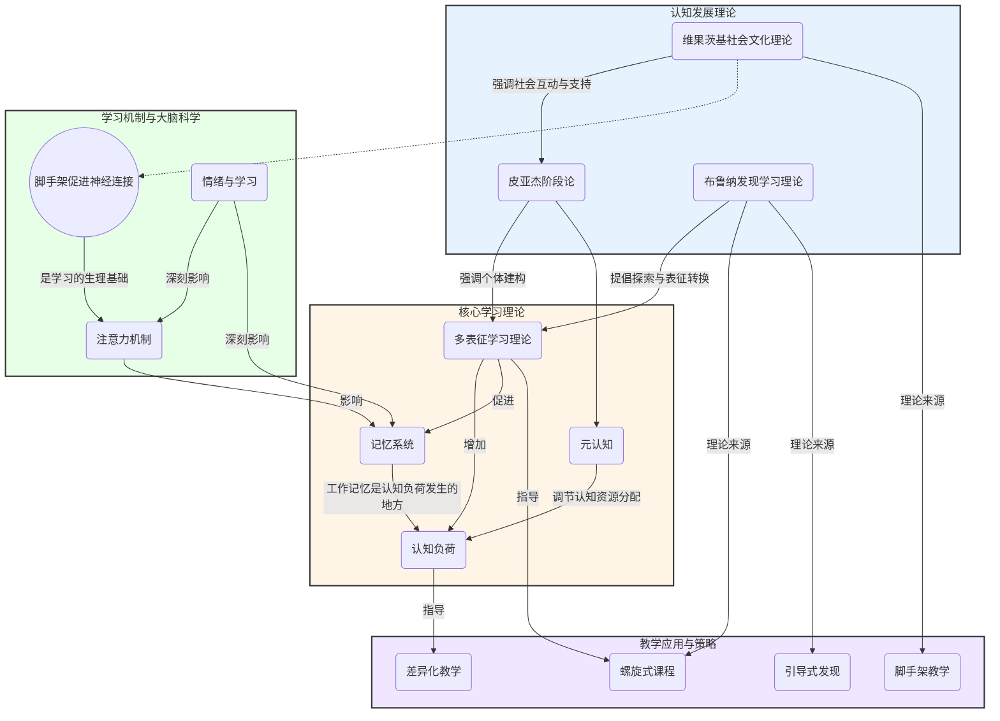

# 01-01-认知科学基础-知识图谱

## 认知科学基础核心概念图

本知识图谱旨在可视化呈现"认知科学基础"中的核心理论与概念及其相互关系。

### 图谱说明

* **四大模块**：
    1. **认知发展理论**（蓝色）：关注学习者心智能力如何随年龄发展，代表人物为皮亚杰、维果茨基等。
    2. **学习机制与大脑科学**（绿色）：揭示学习的生理基础，如大脑如何改变、如何处理信息。
    3. **核心学习理论**（橙色）：聚焦于学习过程中的具体认知模型，如记忆、表征、负荷等。
    4. **教学应用与策略**（紫色）：基于以上理论在教学实践中的具体体现。
* **连接关系**：
  * **实线箭头 `-->`**：表示直接的、强的影响或派生关系。例如，维果茨基的理论直接导出了"脚手架教学"。
  * **虚线箭头 `-.->`**：表示间接的、或引申的关联。例如，脚手架教学的有效实施，其效果体现在促进了学生的神经连接（神经可塑性）。
* **核心关联**：
  * **认知负荷** (`C2`) 是一个中心节点，它受到多表征呈现方式、记忆系统局限以及元认知调控的共同影响。
  * **多表征理论** (`C1`) 是连接认知发展与学习理论的关键桥梁，皮亚杰和布鲁纳的理论都强调了不同表征形式的重要性。
  * 所有理论最终都指向**教学应用与策略** (`D`)，为如何设计有效的教学活动提供理论依据。
