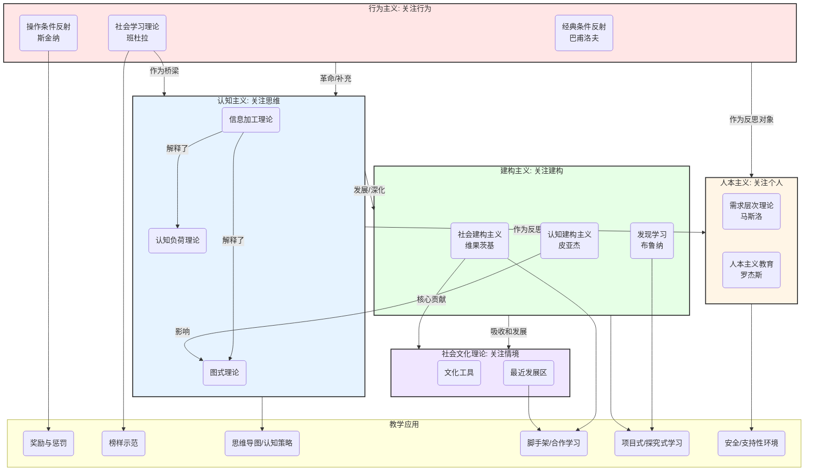

# 01-02-学习理论模型-知识图谱

## 学习理论模型核心概念图

本知识图谱旨在可视化呈现主流学习理论的演进脉络、核心观点及其相互关系。

### 图谱说明

* **五大理论流派**：图谱的核心是五个不同颜色的区块，分别代表行为主义、认知主义、建构主义、人本主义和社会文化理论。每个区块内部列出了该流派的代表性分支或核心概念。
* **演进关系**（大区块之间的箭头）：
  * **革命/补充 `-->`**：表示理论发展的范式转移。例如，认知主义是对行为主义"黑箱"的革命性突破。
  * **作为反思对象 `-->`**：人本主义的兴起，很大程度上是对行为主义和认知主义将人"非人化"研究倾向的一种反思和批判。
  * **班杜拉的桥梁作用**：他的社会学习理论引入了"观察"和"认知"因素，成为从行为主义过渡到认知主义的重要桥梁。
* **核心概念关联**（小节点之间的箭头）：展示了理论内部或理论之间的细化联系。例如，信息加工理论是理解认知负荷和图式理论的基础。
* **教学应用**（底部区块）：展示了不同理论直接导出的具体教学策略和应用。这清晰地表明，尽管理论抽象，但其最终目标是指导实践。例如，"脚手架"教学法直接来源于维果茨基的社会建构主义和文化理论。
