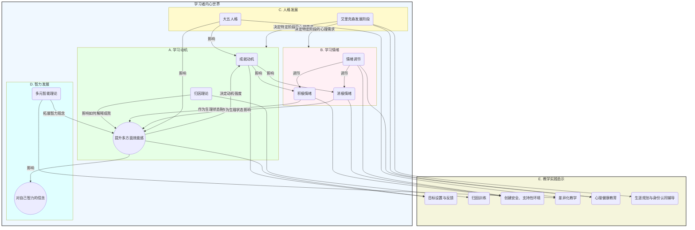

# 01-03-教育心理学原理-知识图谱

## 教育心理学核心概念关系图

本知识图谱旨在可视化呈现教育心理学中关于学习者内部世界的几大核心理论及其相互关系。

### 图谱说明

* **核心模块：学习者内心世界**
  * 整个图谱围绕"学习者"展开，包含四个核心的心理学模块：**学习动机**（绿色）、**学习情绪**（粉色）、**人格发展**（黄色）和**智力发展**（浅蓝色）。这四个模块共同构成了影响学习行为的内部心理因素。

* **模块内部与模块间的相互作用**：
  * **动机系统内部**：一个学生如何**归因**（A2）自己的成功或失败，会直接影响他的**自我效能感**（A3），而自我效能感的高低又决定了他追求成功的**成就动机**（A1）水平。
  * **动机与情绪**：动机的满足与否会引发积极或消极的**情绪**（A1 -> B1/B2）；反之，一个人的情绪状态也会作为一种生理信号，影响其**自我效能感**的判断（B1/B2 -> A3）。
  * **人格是底层背景**：**人格**特质（C2，如尽责性、神经质）是影响个体动机和情绪模式的稳定背景因素。同时，个体所处的**人格发展阶段**（C1），决定了其当前最主要的心理需求和冲突，这深刻地影响着他的动机和情绪状态。
  * **智力与信念**：学生对"智力"的看法（D1 vs D2）会影响他对自身能力的信念，即**自我效能感**（A3）。采纳多元智能观，有助于在更多方面建立学生的效能感。

* **对教学实践的指导**（最下方紫色模块）：
  * 所有理论最终都指向具体的**教学实践启示**。例如，成就动机和自我效能理论指导教师如何进行**目标设置与反馈**（E1）；归因理论指导教师开展**归因训练**（E2）；人格和智力理论共同指向了**差异化教学**（E4）的必要性。
