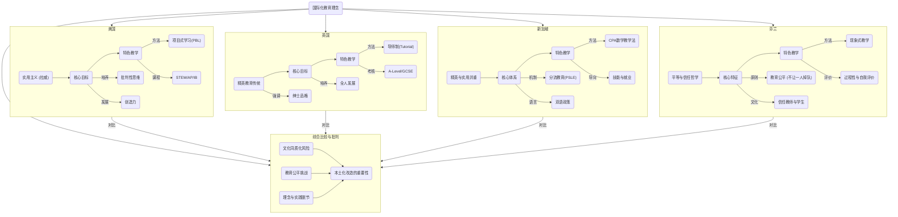

# 01-04-国际化教育理念-知识图谱

```mermaid
graph TD
    A("国际化教育理念") --> B("美国");
    A --> C("英国");
    A --> D("新加坡");
    A --> E("芬兰");
    A --> F("综合比较与批判");

    subgraph B ["美国"]
        B1("实用主义 (杜威)");
        B2("核心目标");
        B3("特色教学");
        B1 --> B2;
        B2 --> B3;
        B2 -- "培养" --> B2_1("批判性思维");
        B2 -- "发展" --> B2_2("创造力");
        B3 -- "方法" --> B3_1("项目式学习(PBL)");
        B3 -- "课程" --> B3_2("STEM/AP/IB");
    end

    subgraph C ["英国"]
        C1("精英教育传统");
        C2("核心目标");
        C3("特色教学");
        C1 --> C2;
        C2 --> C3;
        C1 -- "强调" --> C1_1("绅士品格");
        C2 -- "培养" --> C2_1("全人发展");
        C3 -- "方法" --> C3_1("导师制(Tutorial)");
        C3 -- "考核" --> C3_2("A-Level/GCSE");
    end

    subgraph D ["新加坡"]
        D1("精英与实用并重");
        D2("核心体系");
        D3("特色教学");
        D1 --> D2;
        D2 --> D3;
        D2 -- "机制" --> D2_1("分流教育(PSLE)");
        D2 -- "语言" --> D2_2("双语政策");
        D3 -- "方法" --> D3_1("CPA数学教学法");
        D3 -- "导向" --> D3_2("技能与就业");
    end

    subgraph E ["芬兰"]
        E1("平等与信任哲学");
        E2("核心特征");
        E3("特色教学");
        E1 --> E2;
        E2 --> E3;
        E2 -- "原则" --> E2_1("教育公平 (不让一人掉队)");
        E2 -- "文化" --> E2_2("信任教师与学生");
        E3 -- "方法" --> E3_1("现象式教学");
        E3 -- "评价" --> E3_2("过程性与自我评价");
    end

    subgraph F ["综合比较与批判"]
        F1("文化同质化风险");
        F2("教育公平挑战");
        F3("理念与实践脱节");
        F4("本土化改造的重要性");
        F1 --> F4;
        F2 --> F4;
        F3 --> F4;
    end

    B -- "对比" --> F;
    C -- "对比" --> F;
    D -- "对比" --> F;
    E -- "对比" --> F;

```
