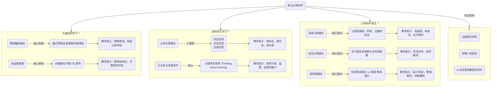

# 01-05-前沿认知科学理论-知识图谱

```mermaid
graph TD
    A("前沿认知科学") --> B("大脑如何学习？");
    A --> C("如何优化学习？");
    A --> D("认知如何发生？");

    subgraph B [大脑如何学习？]
        B1("预测编码理论");
        B2("自由能原理");
        B1 -- "核心机制" --> B1_1("通过'预测误差'更新内部模型");
        B1_1 --> B1_2("教学启示：拥抱错误，制造认知冲突");
        B2 -- "核心原则" --> B2_1("大脑倾向于最小化'意外'");
        B2_1 --> B2_2("教学启示：提供结构化、可预测的环境");
    end

    subgraph C [如何优化学习？]
        C1("认知负荷理论");
        C2("元认知与自我调节");
        C1 -- "三要素" --> C1_1("内在负荷<br/>外在负荷<br/>生成负荷");
        C1_1 --> C1_2("教学启示：减外在、控内在、促生成");
        C2 -- "核心" --> C2_1("对思考的思考 (Thinking about thinking)");
        C2_1 --> C2_2("教学启示：培养计划、监控、反思的能力");
    end

    subgraph D [认知如何发生？]
        D1("具身认知理论");
        D2("社会认知理论");
        D3("双系统理论");
        D1 -- "核心观点" --> D1_1("认知是身体、环境、大脑的互动");
        D1_1 --> D1_2("教学启示：多感官、体验式、动手操作");
        D2 -- "核心观点" --> D2_1("学习是社会观察与合作的结果");
        D2_1 --> D2_2("教学启示：项目合作、同伴教学");
        D3 -- "核心观点" --> D3_1("快思考(系统1) vs 慢思考(系统2)");
        D3_1 --> D3_2("教学启示：设计'刹车'，警惕直觉，训练理性");
    end

    A -- "综合批判" --> E("理论应用挑战");
    subgraph E
        E1("过度简化风险");
        E2("忽略个体差异");
        E3("从实验室到教室的鸿沟");
    end
```
