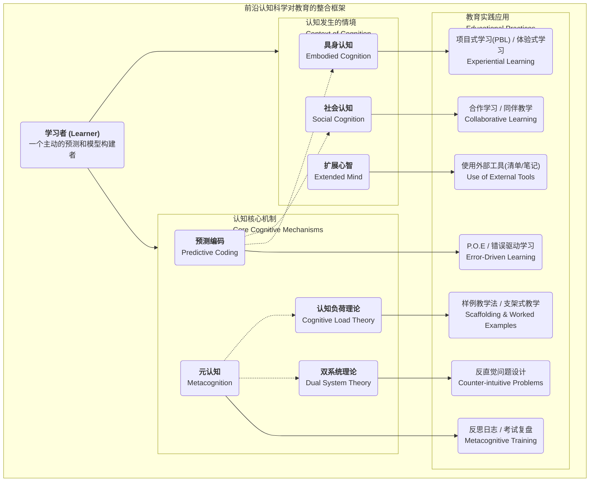

# 01-05-前沿认知科学理论-知识图谱

该知识图谱旨在描绘前沿认知科学的核心理论如何共同作用，并最终指导教育实践，重塑我们对"学习"的理解。

## 核心观点

这个知识图谱的核心观点是：**学习不再是孤立的知识传递，而是学习者作为一个整合的系统（心智-身体-社会），在特定情境中，通过主动预测和修正内在模型，从而实现深度理解的动态过程。** 前沿认知科学的各大理论为我们揭示了这个过程的不同侧面。

## 理论与教育应用关系图谱

## 图谱解读

这份知识图谱将前沿认知科学的核心理论分为了两大模块，并展示了它们如何共同指导具体的教育实践。

1. **认知发生的情境 (Context of Cognition)**:
    * **具身认知**：强调学习离不开身体的感知和行动，直接导向**体验式学习**和**PBL**等教学法，让学生"做中学"。
    * **社会认知**：指出学习是社会互动的结果，知识在群体中被共同建构。这为**合作学习**和**同伴教学**提供了理论基础。
    * **扩展心智**：认为我们的认知能力可以被外部工具（如笔记、清单、电脑）所扩展。这启发我们要教学生如何有效**使用外部工具**来辅助思考和解决复杂问题。

2. **认知核心机制 (Core Cognitive Mechanisms)**:
    * **预测编码**：将学习视为一个"预测-验证-修正"的循环。这直接催生了以**P.O.E.（预测-观察-解释）**和**错误驱动学习**为代表的教学策略，把"犯错"看作学习的引擎。
    * **双系统理论**：揭示了直觉（系统1）和分析（系统2）两种思维模式。教育中可以通过设计**反直觉问题**，有意识地促使学生从快速的系统1切换到深入的系统2进行思考。
    * **认知负荷理论**：为如何呈现信息提供了科学指导。**样例教学法**和**支架式教学**都是其经典应用，旨在降低无关的认知负担，让学生聚焦于知识建构本身。
    * **元认知**：即"对思考的思考"。它是所有学习能力的核心，通过**反思日志**、**考试复盘**等工具进行训练，可以有效指导学生如何更好地应用其他所有学习策略。

3. **理论间的关联 (虚线)**:
    * **元认知**是总指挥，它调控着**双系统**的切换，并帮助我们管理自身的**认知负荷**。
    * **预测编码**作为底层的学习机制，其预测的形成离不开**具身**的体验和**社会**的互动。

总之，高效的学习体验设计，需要系统性地将这些理论综合起来。例如，一个优秀的PBL项目，必然是**具身的**（动手做）、**社会的**（团队合作）、利用**扩展心智**的（项目管理工具），并巧妙地运用**预测编码**（挑战性问题）、管理**认知负荷**（适时的脚手架）、激活**双系统**（反思与创造），并最终通过**元认知**实现能力的迁移和提升。
