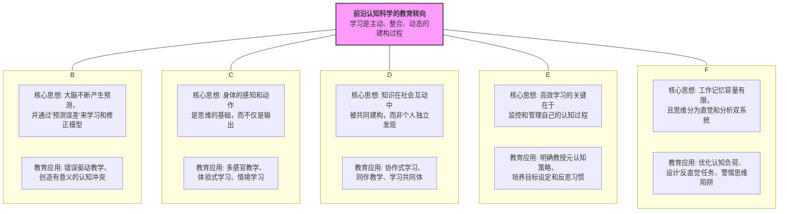

# 01-05-前沿认知科学理论-知识图谱

该知识图谱旨在描绘前沿认知科学如何重塑我们对"学习"的理解，展示其核心理论分支及教育应用。

## 核心观点

这个知识图谱的核心观点是：**学习不再被看作是静态的知识传递，而是学习者作为一个整合的系统（心智-身体-社会），主动与世界互动、不断修正内在模型、并最终学会如何学习的动态过程。** 各大前沿理论如同拼图的各个板块，共同构成了一幅关于"深度学习"如何发生的完整图景。

## 知识图谱

## 图谱解读

1.  **中心节点：教育转向**: 图谱的核心是"教育转向"这一理念。它标志着教育的重心从"教什么"转向"学习如何发生"。

2.  **五大理论分支**:
    - **预测心智**: 这是对学习机制最底层的解释之一。它告诉我们，有效学习始于一次"有根据的猜测"，而"犯错"是学习过程中最宝贵的信号。这颠覆了视"错误"为失败的传统教学观。
    - **具身认知**: 该理论将学习从纯粹的大脑活动"解放"出来，强调了物理环境、身体姿态、感官体验的重要性。它提醒教育者，学习空间和教学工具的设计本身就是教学内容的一部分。
    - **社会认知**: 此分支强调，学习本质上是"部落"行为。我们通过观察他人、与人合作、分享故事来学习。它为"小组合作"等教学法提供了深层的理论依据，指出真正的合作是意义的共创，而非简单的任务分配。
    - **自我调节**: 如果说其他理论解释了学习如何发生，那么自我调节理论则赋予了学习者"驾驶"这一过程的能力。它强调，教会学生如何学习（元认知）比单纯传授知识本身更为重要，是教育的终极目标。
    - **认知建构**: 该理论像是学习大厦的"工程图纸"，揭示了我们认知系统的内在限制（如工作记忆瓶颈）和基本模式（双系统）。它为教学设计提供了最直接的约束条件和指导原则，提醒我们必须在尊重认知规律的基础上进行教学创新。
