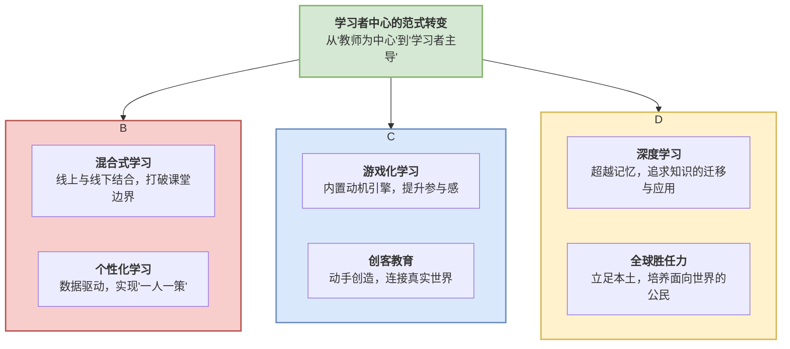

# 01-06-创新教育学理论-知识图谱

该知识图谱旨在描绘"创新教育学"的内在结构，展示其如何围绕"以学习者为中心"这一核心，通过重构教学模式、设计学习体验和升级教育目标，形成一个相互关联的理论生态系统。

## 核心观点

**创新教育学的本质是一场从"以教师为中心的内容灌输"到"以学习者为中心的范式转变"。** 这个转变并非单一理论的功劳，而是由一系列理论共同支撑的系统性变革。本图谱将其归纳为三大支柱：

1. **教学模式重构**：改变知识传递的"时空"。
2. **学习体验设计**：改变学习过程的"感受"。
3. **核心目标升级**：改变教育追求的"终点"。

## 知识图谱

## 图谱解读

1. **中心节点：学习者中心的范式转变**
    这是所有创新教育理论的共同出发点和归宿。它意味着教育的权力中心发生了转移，学生不再是知识的被动接收者，而是学习过程的主动建构者、探索者和拥有者。

2. **支柱一：教学模式重构**
    这个支柱主要解决"教与学"在时间和空间上的组织形式问题。
    - **混合式学习**：通过线上线下的结合，将知识的传递（适合线上）与知识的内化（适合线下互动）分离开来，实现了学习时空的极大延伸和优化。**翻转课堂**是其最经典的模式。
    - **个性化学习**：借助技术手段，它试图破解工业时代"标准化教学"的难题。通过数据分析，为每个学生提供定制化的学习内容、节奏和路径，使"因材施教"这一古老理想有了大规模实现的可能性。

3. **支柱二：学习体验设计**
    这个支柱关注学习过程中的"用户体验"，旨在提升学生的内在动机和参与感。
    - **游戏化学习**：它并非简单地把学习变成游戏，而是将游戏中最吸引人的元素（如即时反馈、挑战、成就、合作）提取出来，融入学习设计中，让学习本身变得像游戏一样引人入胜。
    - **创客教育**：它强调"从做中学"，让学生通过动手解决真实问题，将抽象知识具象化。它将学习从"消费知识"转变为"创造知识"，让学生在创造中获得最深刻的成就感。

4. **支柱三：核心目标升级**
    这个支柱回答了"我们为什么要学习"的根本问题，标志着教育目标的与时俱进。
    - **深度学习**：它明确反对碎片化、机械性的知识记忆。其核心目标是培养学生的高阶思维能力，让学生能够理解知识背后的原理，并能将所学灵活地**迁移**到新的、非结构化的问题情境中。
    - **全球胜任力**：在全球化时代，教育的目标不再是培养只适应本国环境的人才。它要求学生能理解和尊重不同的文化，具备跨文化沟通与协作的能力，并能就全球性议题（如气候变化、公共卫生）进行系统性思考。
