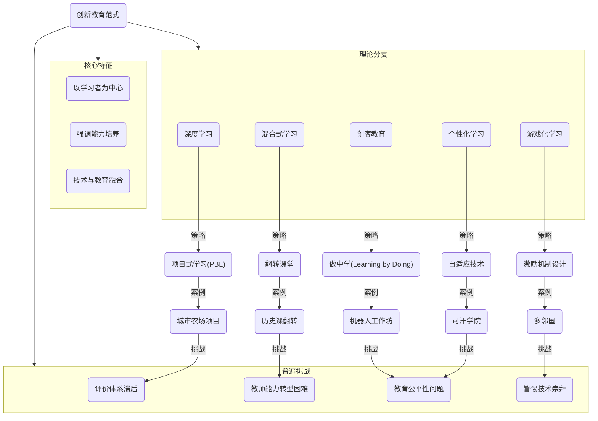

# 01-06-创新教育学理论-知识图谱

```mermaid
graph TD
    A("创新教育范式") --> B("理论分支");
    A --> C("核心特征");
    A --> D("普遍挑战");

    subgraph C [核心特征]
        C1("以学习者为中心");
        C2("强调能力培养");
        C3("技术与教育融合");
    end

    subgraph D [普遍挑战]
        D1("评价体系滞后");
        D2("教师能力转型困难");
        D3("教育公平性问题");
        D4("警惕技术崇拜");
    end

    subgraph B [理论分支]
        B1("深度学习");
        B2("个性化学习");
        B3("混合式学习");
        B4("游戏化学习");
        B5("创客教育");
    end

    B1 -- "策略" --> B1_1("项目式学习(PBL)");
    B1_1 -- "案例" --> B1_2("城市农场项目");
    B1_2 -- "挑战" --> D1;

    B2 -- "策略" --> B2_1("自适应技术");
    B2_1 -- "案例" --> B2_2("可汗学院");
    B2_2 -- "挑战" --> D3;

    B3 -- "策略" --> B3_1("翻转课堂");
    B3_1 -- "案例" --> B3_2("历史课翻转");
    B3_2 -- "挑战" --> D2;

    B4 -- "策略" --> B4_1("激励机制设计");
    B4_1 -- "案例" --> B4_2("多邻国");
    B4_2 -- "挑战" --> D4;

    B5 -- "策略" --> B5_1("做中学(Learning by Doing)");
    B5_1 -- "案例" --> B5_2("机器人工作坊");
    B5_2 -- "挑战" --> D3;

```
