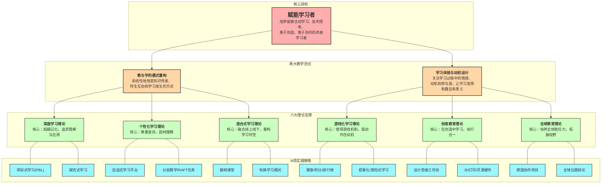

# 创新教育学理论：理论与实践知识图谱

## 创新教育行动地图

本知识图谱旨在提供一张清晰的“行动地图”，它将创新教育的宏大理念与具体的课堂实践联系起来。图谱围绕一个核心目标，通过两大教学范式，由六个核心理论支撑，并最终落地为一系列可操作的教学策略。

## 图谱解读

这张“创新教育行动地图”自上而下地揭示了从“为什么（Why）”到“是什么（What）”再到“怎么做（How）”的完整逻辑链条。

1. **核心目标 (Why)**：所有创新教育理论的出发点和最终归宿，都是为了**赋能学习者**。我们进行教育变革，不是为了追逐时髦的技术或概念，而是为了培养出更具能动性、创造力和适应性的未来公民。这是我们一切行动的“北极星”。

2. **两大教学范式 (What)**：为了实现上述目标，教育变革主要发生在两个核心范式上：
    - **教与学的模式重构**：这一范式关注的是教育的“硬件”和“流程”。它旨在回答：我们如何从根本上改变传统的、以教师为中心的知识传递模式？这里的变革是系统性的，涉及时间、空间和角色的大规模调整。
    - **学习体验与动机设计**：这一范式关注的是教育的“软件”和“情感”。它旨在回答：我们如何让学习过程本身变得更吸引人、更能激发学生的内在动机？这里的变革聚焦于学习者的情感体验和心理需求。

3. **六大理论支撑 (What -> How)**：两大范式分别由一系列核心理论作为支撑：
    - **支撑“模式重构”的理论**：
      - `深度学习理论` 提供了“学什么”的答案——学习应该超越事实记忆，指向深层理解和应用。
      - `个性化学习理论` 提供了“为谁学”的答案——学习应适应每个学生的独特需求。
      - `混合式学习理论` 提供了“时空如何组织”的答案——通过线上线下的融合来优化学习流程。
    - **支撑“体验与动机设计”的理论**：
      - `游戏化学习理论` 提供了“如何更有趣”的答案——借用游戏机制来激发参与感和成就感。
      - `创客教育理论` 提供了“如何更真实”的答案——通过动手创造来连接知识与现实世界。
      - `全球教育理论` 提供了“如何更有格局”的答案——通过引入跨文化和全球性议题来拓宽学生的视野和同理心。

4. **N项实践策略 (How)**：每个核心理论最终都将落地为一系列具体的、教师可以在课堂上操作的实践策略。例如：
    - `深度学习` 常常通过 `项目式学习（PBL）` 和 `探究式学习` 来实现。
    - `个性化学习` 可以借助 `自适应学习平台` 或 `分层教学` 来实施。
    - `游戏化学习` 则具体化为 `徽章系统`、`积分榜` 等机制。

**如何使用这张地图？**
教师可以从图谱的任何一个节点出发进行思考。可以**自上而下**，从“赋能学习者”的目标出发，选择合适的范式和理论来设计一门全新的课程；也可以**自下而上**，从一个具体的实践策略（如“我想尝试翻转课堂”）出发，反思它背后支撑的理论是什么，以及它如何服务于最终的核心目标。这张图谱旨在成为教师在创新教育道路上的一位思考伙伴和行动向导。
