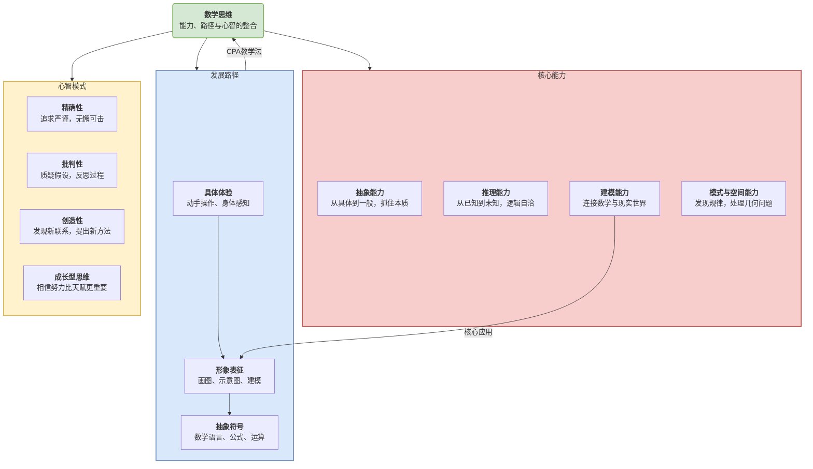

# 02-01-数学思维培养-知识图谱

该知识图谱旨在描绘"数学思维"的内在结构。它并非单一的能力，而是一个由**核心能力**、**发展路径**和**心智模式**三个维度共同构成的整合性框架。

## 核心观点

**真正的数学思维，是"能力"、"路径"与"心智"的协同。**

- **能力**是我们的"武器库"，定义了我们能用数学做什么。
- **路径**是我们的"成长地图"，揭示了我们如何获得这些能力。
- **心智**是我们的"内功心法"，决定了我们使用这些武器和地图时的态度与信念。

## 知识图谱

## 图谱解读

1. **中心节点：数学思维**
    它是一个综合体，强调了三种维度的缺一不可。只拥有计算能力而缺乏成长型心智，或只推崇探究路径而忽略核心能力的培养，都无法构成健全的数学思维。

2. **维度一：核心能力 (What I can do?)**
    这是数学思维的"硬技能"，是我们可以观察和评估的外在表现。
    - **抽象能力**：是数学的根基，指从万事万物中剥离出其数量关系和空间形式的能力。
    - **推理能力**：是数学的骨架，包括从特殊案例中发现规律的**归纳推理**，和从一般公理出发进行严谨推导的**演绎推理**。
    - **建模能力**：是数学的桥梁，是将现实世界的混乱问题，翻译成结构化的数学问题，并用数学方法求解，最后再将结果应用回现实世界的能力。
    - **模式与空间能力**：是对数学世界中"美"的感知，包括发现数列、图形中的规律，以及在头脑中操作几何体的能力。

3. **维度二：发展路径 (How I learn?)**
    这个维度揭示了数学能力培养应遵循的认知规律，其中**CPA教学法**是其最经典的体现。
    - **从具体到抽象**: 任何抽象的数学概念，都应始于学生能够触摸和感知的**具体体验**（如用积木学加法）。
    - **形象的"脚手架"**: 在具体和抽象之间，需要一个**形象表征**的中间环节（如画图）。数学建模很大程度上就是一种高级的形象表征活动。
    - **有意义的符号**: 只有经历了前两个阶段，学生才能真正理解**抽象符号**背后的深刻含义，而不是将其当作无意义的文字进行死记硬背。

4. **维度三：心智模式 (How I think?)**
    这是数学思维的"软实力"，是内化的信念、态度和思维习惯。
    - **精确性**：是对数学严谨性的尊重，体现在对单位、等号、小数点的细致处理上。
    - **批判性**：是不满足于找到答案，而是会回头审视自己的解题过程，思考"有没有更好的方法？""我的假设合理吗？"。
    - **创造性**：是敢于跳出常规，在不同知识点之间建立意想不到的联系，或用全新的视角看待一个旧问题。
    - **成长型思维**：是面对难题时，相信"我只是'暂时'还不会"，而不是"我天生就笨"。这是所有学习能够发生的最重要的心理基础。
