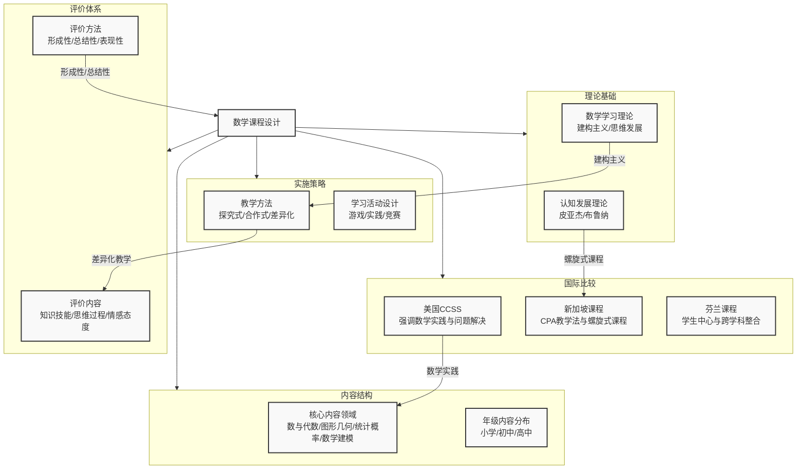

# 02-02-数学课程设计-知识图谱

---

### 知识图谱说明

这个知识图谱旨在系统性地呈现**数学课程设计**的全貌，它围绕五个核心分支展开：

1. **理论基础 (Theoretical Foundations)**：这是课程设计的出发点，主要包含两个方面。
    * **认知发展理论**：如皮亚杰的阶段论和布鲁纳的螺旋式课程理论，它们决定了课程内容在不同年龄段的呈现方式和深度。
    * **数学学习理论**：如建构主义，强调学生的主动学习，这直接影响了教学方法的选择（如探究式学习）。

2. **内容结构 (Content Structure)**：明确"教什么"的问题。
    * **核心内容领域**：划分了数学知识的四大板块，是课程内容的基石。
    * **年级内容分布**：将这些知识具体地、循序渐进地分配到各个学年。

3. **实施策略 (Implementation Strategies)**：关注"怎么教"的问题。
    * **教学方法**：提供了宏观的教学指导思想，如探究式、合作式等。
    * **学习活动**：将教学方法具体化为可操作的课堂活动，如数学游戏和实践项目。

4. **评价体系 (Evaluation System)**：解决"如何评估学习效果"的问题。
    * **评价内容**：明确了评价的三个维度，不仅关注结果（知识技能），也关注过程（思维）和情感。
    * **评价方法**：提供了多元的评价工具，强调形成性评价与总结性评价的结合。

5. **国际比较 (International Comparison)**：提供了外部参照系和发展趋势。
    * 通过对比美国（CCSS）、新加坡（CPA）、芬兰的课程特色，可以为我们自身的课程设计提供宝贵的经验和启示。例如，新加坡的螺旋式课程设计正是布鲁纳理论的成功实践。

**核心关联**：图谱中的虚线箭头展示了各个模块之间的内在逻辑。例如，认知理论（特别是布鲁纳）直接催生了螺旋式课程（新加坡模式）；建构主义学习理论是探究式、合作式等教学方法的基础；而美国的CCSS标准则极大地影响了其内容结构中对"数学实践"的强调。整个图谱构成了一个从理论到实践，再到评价与反思的完整闭环。
