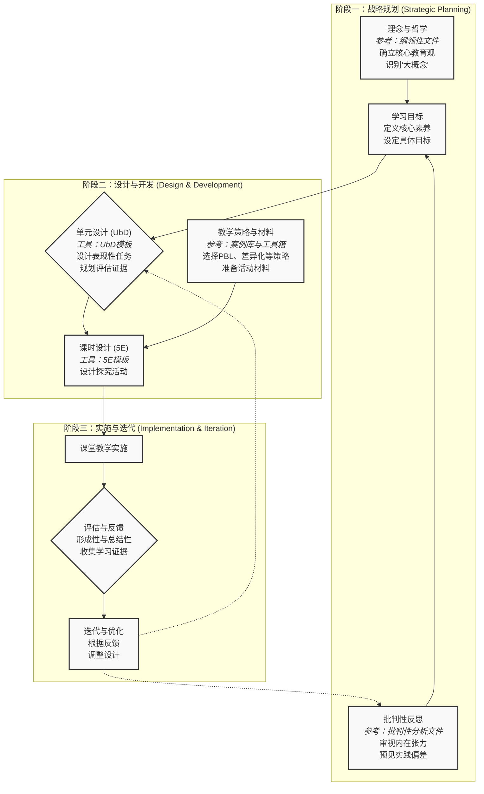

# 02-02-数学课程设计-知识图谱

---

## 工作流说明：将理论转化为实践的循环之旅

本图谱展示的不是一个静态的知识清单，而是一个动态的、循环的**数学课程设计工作流**。它旨在为课程设计师提供一个从宏观到微观，再从实践回归反思的行动路线图。本图谱整合了"02-02-数学课程设计"主题下所有相关文档的核心思想。

### 阶段一：战略规划 (Strategic Planning) - "我们为何而教，教向何方？"

这是设计的起点，决定了课程的"灵魂"。

- **理念与哲学 (A)**：设计师首先要明确自己的教育哲学和对数学学科的理解，识别出希望贯穿始终的"大概念"。这是整个设计的"北极星"，其详细内容可参考本主题的**《纲领性文件》**。
- **批判性反思 (C)**：在确立目标之前，必须进行清醒的自我审视。设计师应预见并思考各种先进理念（如PBL、差异化教学）中存在的内在张力与实践偏差。这份"清醒"来源于本主题的**《批判性反思》**文件，它能有效防止好心办坏事。
- **学习目标 (B)**：在哲学思考和批判性反思的基础上，设计师才能设定出既有理想高度、又具现实可行性的核心素养与学习目标。

### 阶段二：设计与开发 (Design & Development) - "我们如何将蓝图变为现实？"

这是将战略转化为具体教学计划的核心阶段。

- **单元设计 (D)**：以**《设计师工具箱》**中的"UbD模板"为框架，进行"逆向设计"，优先规划最终的"表现性任务"和评估证据。
- **课时设计 (E)**：在单元框架内，用"5E模型"等工具设计每一节具体的、以学生探究为中心的课时。
- **教学策略与材料 (F)**：根据单元和课时的需要，从**《实践案例解析》**中汲取灵感，选择最合适的教学策略（如PBL），并利用**《设计师工具箱》**中的资源准备教学材料。

### 阶段三：实施与迭代 (Implementation & Iteration) - "我们如何知道是否有效，并持续改进？"

这是检验设计、并使其不断生长的闭环阶段。

- **实施与评估 (G, H)**：将设计付诸课堂实践，并通过形成性和总结性评估，收集关于学生学习的真实证据。
- **迭代与优化 (I)**：评估的最终目的不是为了打分，而是为了改进。从评估中获得的反馈，将成为下一轮设计的宝贵输入。如图中虚线所示，这些反馈将促使我们重新进行**批判性反思 (C)**，并优化我们的**单元设计 (D)**，从而形成一个永不停止的、螺旋上升的专业发展循环。

**总结**：这张图谱不仅是对"数学课程设计"这一主题的知识总结，更是对之前所有工作的行动整合。它清晰地展示了从理论到实践，再从实践到反思的完整路径，为设计卓越的数学课程提供了一份可视化指南。
