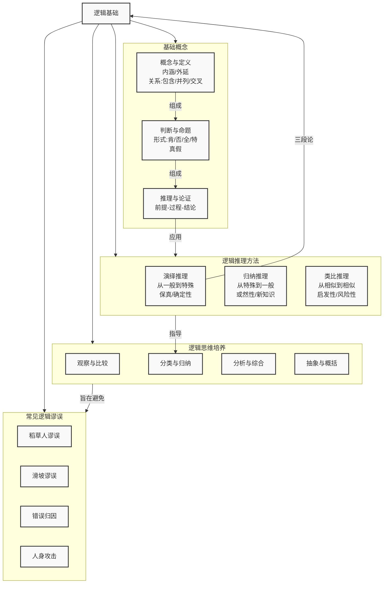

# 03-01-逻辑基础-知识图谱

---

### 知识图谱说明

这个知识图谱系统地构建了**逻辑基础**的知识体系，分为四大核心模块：

1. **基础概念 (Basic Concepts)**：这是逻辑思维的基石，是进行任何复杂推理前的"语法"规则。
    - 它始于最基本的单位**概念**，进而由概念构成**判断与命题**，再由命题组成**推理与论证**的结构。这是一个层次分明、逐级递进的体系。

2. **逻辑推理方法 (Methods of Reasoning)**：这是逻辑思维的核心"算法"，是得出结论的主要路径。
    - **演绎推理**：如同严谨的数学证明，从普遍公理出发，保证结论的可靠性，是知识"验证"的工具。
    - **归纳推理**：如同科学家的探索，从大量事实中总结规律，是知识"发现"的引擎。
    - **类比推理**：如同思想家的灵感，通过联想和迁移，是知识"创新"的火花。

3. **逻辑思维培养 (Cultivation of Logical Thinking)**：这是将逻辑理论转化为个人能力的实践步骤。
    - 如图所示，这些培养方法（如分类、分析、抽象）与逻辑推理紧密相关。例如，"分类与归纳"就是归纳推理在实践中的具体应用。这些方法帮助我们将逻辑规则内化为一种思维习惯。

4. **常见逻辑谬误 (Common Fallacies)**：这是逻辑应用的"避坑指南"。
    - 了解这些常见的思维陷阱，是逻辑思维从"建构"走向"批判"的必要一环。它是对前述所有逻辑规则的反向应用，通过识别错误来加深对正确的理解。

**核心关联**：图谱通过箭头清晰地展示了模块间的关系。基础概念是推理方法的前提；推理方法指导着思维培养的具体操作；而思维培养的整体目标之一，就是能熟练运用逻辑规则，从而识别并**避免**常见的逻辑谬误。整个结构形成了一个从"学理"到"应用"，再到"纠偏"的认知闭环。
