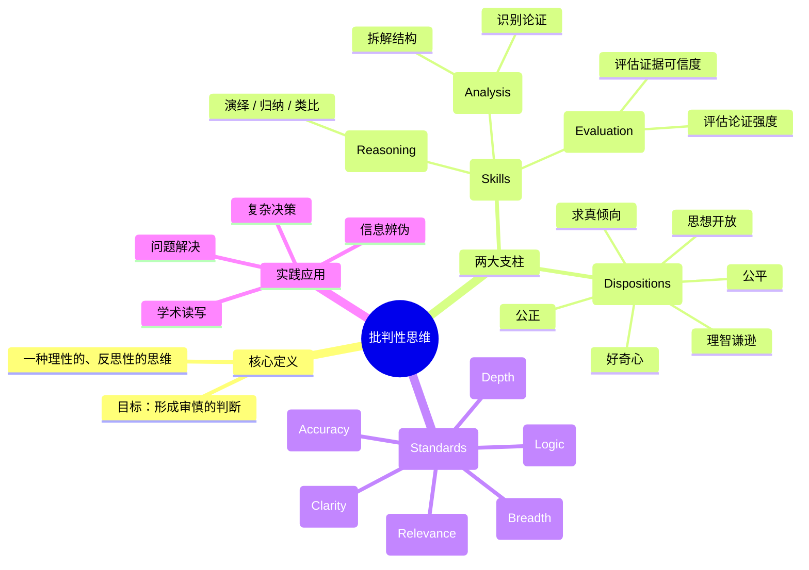

# 03-02-批判性思维-知识图谱

```mermaid
mindmap
  root((批判性思维))
    核心定义
      一种理性的、反思性的思维
      目标：形成审慎的判断
    两大支柱
      思维技能 (Skills)
        分析 (Analysis)
          识别论证
          拆解结构
        推理 (Reasoning)
          演绎 / 归纳 / 类比
        评价 (Evaluation)
          评估证据可信度
          评估论证强度
      思维品格 (Dispositions)
        求真倾向
        思想开放
        理智谦逊
        公正
        公平
        好奇心
    评价标尺 (Standards)
      清晰性 (Clarity)
      准确性 (Accuracy)
      相关性 (Relevance)
      逻辑性 (Logic)
      深度 (Depth)
      广度 (Breadth)
    实践应用
      信息辨伪
      复杂决策
      问题解决
      学术读写
```
