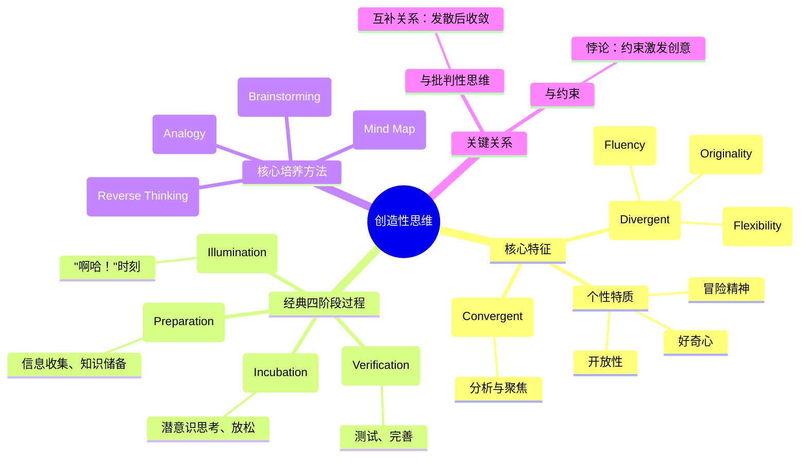

# 《创造性思维》知识图谱

```mermaid
mindmap
  root((创造性思维))
    核心特征
      发散思维 (Divergent)
        流畅性 (Fluency)
        灵活性 (Flexibility)
        独特性 (Originality)
      收敛思维 (Convergent)
        分析与聚焦
      个性特质
        好奇心
        开放性
        冒险精神
    经典四阶段过程
      1. 准备 (Preparation)
         信息收集、知识储备
      2. 酝酿 (Incubation)
         潜意识思考、放松
      3. 顿悟 (Illumination)
         "啊哈！"时刻
      4. 验证 (Verification)
         测试、完善
    核心培养方法
      头脑风暴 (Brainstorming)
      类比思维 (Analogy)
      逆向思维 (Reverse Thinking)
      思维导图 (Mind Map)
    关键关系
      与批判性思维
        互补关系：发散后收敛
      与约束
        悖论：约束激发创意
``` 