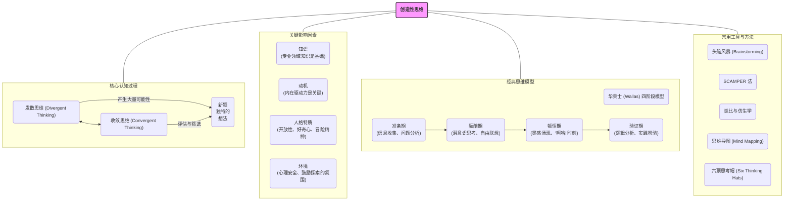

# 03-03-创造性思维-知识图谱

## 创造性思维核心概念图

## 图谱解读

该知识图谱旨在描绘"创造性思维"的完整框架。

1. **中心节点**：
    - **创造性思维**：图谱的核心，它是一种产生新颖、独特且有价值想法的复杂心理过程。

2. **四大模块**：
    - **核心认知过程**：揭示了创造性思维的"引擎"。它并非单一的思维模式，而是**发散思维**和**收敛思维**的动态平衡。发散思维负责"广度"，产生大量想法；收敛思维负责"深度"，对想法进行评估、筛选和聚焦。两者缺一不可，循环往复。
    - **关键影响因素**：指出了滋养创造力的土壤。创造力不是空中楼阁，它需要深厚的**知识**作为根基，强烈的内在**动机**作为燃料，开放、好奇的**人格特质**作为催化剂，以及一个允许犯错、鼓励探索的外部**环境**。
    - **经典思维模型**：展示了创造性想法诞生的典型路径。华莱士的四阶段模型（**准备 -> 酝酿 -> 顿悟 -> 验证**）是一个经典框架，它说明了创造并非总是线性的、一步到位的，其中包含了有意识的努力（准备、验证）和无意识的加工（酝酿、顿悟）。
    - **常用工具与方法**：提供了将创造力付诸实践的"工具箱"。这些方法，如**头脑风暴**、**SCAMPER**、**类比**等，为个人和团队提供了具体的、可操作的思维"脚手架"，帮助人们系统性地打破思维定势，从不同角度发现创新的可能性。

总之，该图谱强调了创造性思维是一个集认知过程、个体特质、外部环境和实践方法于一体的综合性能力，它既有规律可循，也充满了动态和变化。
