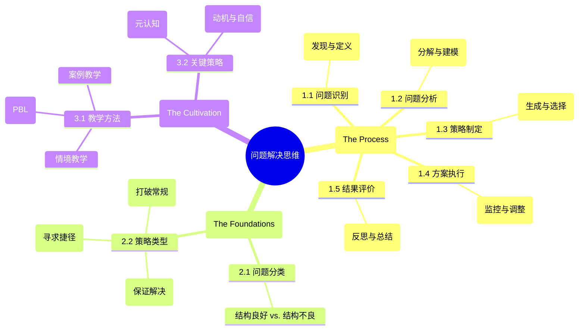

# 03-04 问题解决思维-知识图谱

## 核心概念关系图

## 图谱解读

1.  **中心节点：问题解决思维**
    - 它不是单一的技能，而是一个循环往复、螺旋上升的综合认知活动。其核心在于将一个"未知状态"转化为"目标状态"。

2.  **分支一：核心过程 (The Process)**
    - 这是问题解决的"行动路线图"，一个理想化的五步模型。
    - **问题识别**是起点，强调准确定义问题比急于寻找答案更重要。
    - 从**分析**到**执行**，再到**评价**，构成了一个完整的"发现-设计-执行-反思"的闭环。这个过程不是严格线性的，优秀的解决者常常在各阶段之间灵活跳转。

3.  **分支二：两大基石 (The Foundations)**
    - 这是支撑整个问题解决过程的理论基础。
    - **问题分类**：理解问题的性质是选择正确工具的前提。面对一个有标准答案的数学题（结构良好）和一个"如何提升团队士气"的管理问题（结构不良），所需要的思维方式截然不同。
    - **策略类型**：这是我们的"思维工具箱"。**算法策略**像一本菜谱，按部就班保证能做出一道菜；**启发式策略**则像一位经验丰富的大厨，凭直觉和经验走捷径；**创造性策略**则是要发明一道全新的菜。

4.  **分支三：培养路径 (The Cultivation)**
    - 这揭示了如何将问题解决思维内化为学生的能力。
    - **教学方法**：强调问题解决能力的培养不能靠单纯的讲授，必须通过**情境、项目、案例**等方式，让学生在"做"中学。
    - **关键策略**：培养问题解决能力，不仅要教给学生具体的解题方法（认知策略），更要关注他们的**元认知**（对自己思考过程的思考）和**情感状态**（面对困难时的动机、兴趣与自信）。后者是决定学生能否坚持到底的关键。 