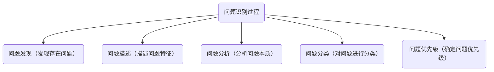
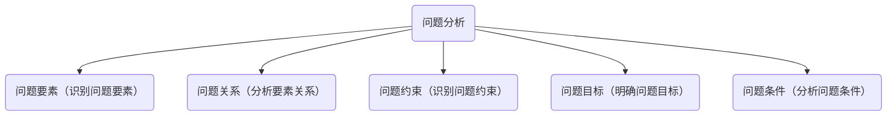
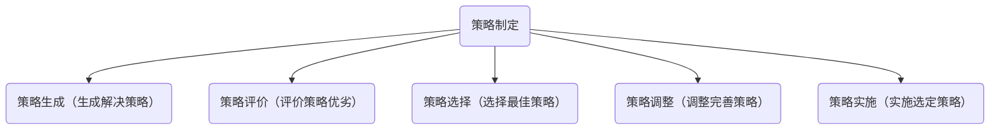
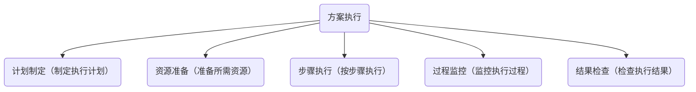
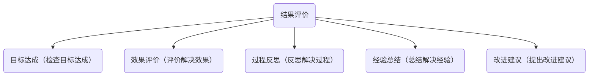
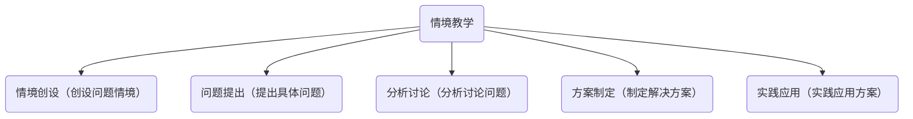

# 03-04 问题解决思维

## 目录

1. [问题解决概述](#1-问题解决概述)
2. [问题解决过程](#2-问题解决过程)
3. [问题解决策略](#3-问题解决策略)
4. [问题解决培养](#4-问题解决培养)
5. [问题解决应用](#5-问题解决应用)

---

## 1. 问题解决概述

### 1.1 什么是问题解决

> 问题解决是一种认知过程，通过分析问题、制定策略、执行方案来达到目标，具有以下特征：

- **目标导向**：有明确的目标
- **认知过程**：需要认知参与
- **策略运用**：运用各种策略
- **结果导向**：追求问题解决

### 1.2 问题解决的价值

> 认知价值：

- 提高思维能力
- 增强分析能力
- 培养决策能力
- 发展创新能力

> 生活价值：

- 解决实际问题
- 提高生活质量
- 增强自信心
- 培养责任感

---

## 2. 问题解决过程

### 2.1 问题识别

> 问题识别：



**问题类型**：

- **结构良好问题**：有明确解决方法
- **结构不良问题**：没有明确解决方法
- **开放性问题**：有多种解决方案
- **封闭性问题**：有唯一解决方案

### 2.2 问题分析

> 问题分析：



**分析方法**：

- **分解法**：将问题分解为子问题
- **类比法**：寻找相似问题
- **逆向法**：从目标倒推
- **系统法**：系统分析问题

### 2.3 策略制定

> 策略制定：



**策略类型**：

- **算法策略**：按步骤执行
- **启发式策略**：经验性方法
- **创造性策略**：创新性方法
- **合作策略**：协作解决问题

### 2.4 方案执行

> 方案执行：



**执行要素**：

- **时间管理**：合理安排时间
- **资源管理**：有效利用资源
- **过程控制**：控制执行过程
- **结果评估**：评估执行结果

### 2.5 结果评价

> 结果评价：



**评价标准**：

- **有效性**：是否有效解决问题
- **效率性**：是否高效解决问题
- **经济性**：是否经济解决问题
- **创新性**：是否创新解决问题

---

## 3. 问题解决策略

### 3.1 算法策略

> 算法策略：

- **步骤明确**：有明确的步骤
- **结果确定**：有确定的结果
- **适用广泛**：适用多种问题
- **效率较高**：解决效率较高

> 算法类型：

- **数学算法**：数学计算方法
- **逻辑算法**：逻辑推理方法
- **程序算法**：计算机程序方法
- **决策算法**：决策分析方法

### 3.2 启发式策略

> 启发式策略：

- **经验性**：基于经验判断
- **灵活性**：灵活运用方法
- **实用性**：实用性强

> 启发式方法：

- **手段-目的分析**：分析手段和目标
- **逆向工作**：从目标倒推
- **类比推理**：运用类比推理
- **简化问题**：简化复杂问题

### 3.3 创造性策略

> 创造性策略：

- **发散思维**：多角度思考
- **逆向思维**：反向思考
- **联想思维**：联想相关事物
- **组合思维**：组合不同元素

> 创造方法：

- **头脑风暴**：集体头脑风暴
- **思维导图**：绘制思维导图
- **六顶思考帽**：多角度思考
- **TRIZ方法**：创新问题解决

---

## 4. 问题解决培养

### 4.1 培养原则

> 培养原则：

- **循序渐进**：从简单到复杂
- **实践导向**：注重实践应用
- **个性化**：尊重个体差异
- **合作性**：培养合作能力
- **创新性**：鼓励创新思维

### 4.2 培养方法

> 情境教学法：



> 项目教学法：

- **项目设计**：设计项目任务
- **团队合作**：团队合作完成
- **过程指导**：指导解决过程
- **结果展示**：展示项目成果

> 案例教学法：

- **案例选择**：选择合适案例
- **案例分析**：分析案例问题
- **方案设计**：设计解决方案
- **效果评价**：评价解决效果

### 4.3 培养策略

> 认知策略：

- **元认知策略**：监控认知过程
- **认知监控**：监控问题解决
- **认知调节**：调节解决策略
- **认知评价**：评价解决效果

> 情感策略：

- **动机激发**：激发解决动机
- **兴趣培养**：培养解决兴趣
- **自信建立**：建立解决自信
- **毅力培养**：培养坚持毅力

---

## 5. 问题解决应用

### 5.1 学习应用

**学科问题**：

```text
学科问题解决
├── 数学问题（解决数学问题）
├── 科学问题（解决科学问题）
├── 语言问题（解决语言问题）
├── 艺术问题（解决艺术问题）
└── 体育问题（解决体育问题）
```

**学习问题**：

- **学习方法**：改进学习方法
- **学习困难**：克服学习困难
- **学习计划**：制定学习计划
- **学习评价**：评价学习效果

### 5.2 生活应用

**生活问题**：

- **日常生活**：解决日常问题
- **人际交往**：解决人际问题
- **时间管理**：解决时间问题
- **情绪管理**：解决情绪问题

**实际问题**：

```text
实际问题解决
├── 家庭问题（解决家庭问题）
├── 学校问题（解决学校问题）
├── 社会问题（解决社会问题）
└── 环境问题（解决环境问题）
```

### 5.3 社会应用

**社会问题**：

- **社区问题**：解决社区问题
- **环境问题**：解决环境问题
- **安全问题**：解决安全问题
- **发展问题**：解决发展问题

**职业应用**：

- **工作问题**：解决工作问题
- **团队问题**：解决团队问题
- **创新问题**：解决创新问题
- **发展问题**：解决发展问题

---

## 总结

问题解决思维是重要的思维能力，需要从儿童时期开始培养。通过系统的训练和实践，可以培养学习者的问题解决能力，提高其分析、决策、创新能力。

**关键要点**：

1. 问题解决具有目标导向、认知过程、策略运用特征
2. 问题解决包括识别、分析、制定、执行、评价五个阶段
3. 问题解决策略包括算法、启发式、创造性策略
4. 问题解决培养需要科学的方法和策略
5. 问题解决在学习、生活、社会中有广泛应用

---

*下一节：[04-02-外语教育](./04-02-外语教育.md)*
