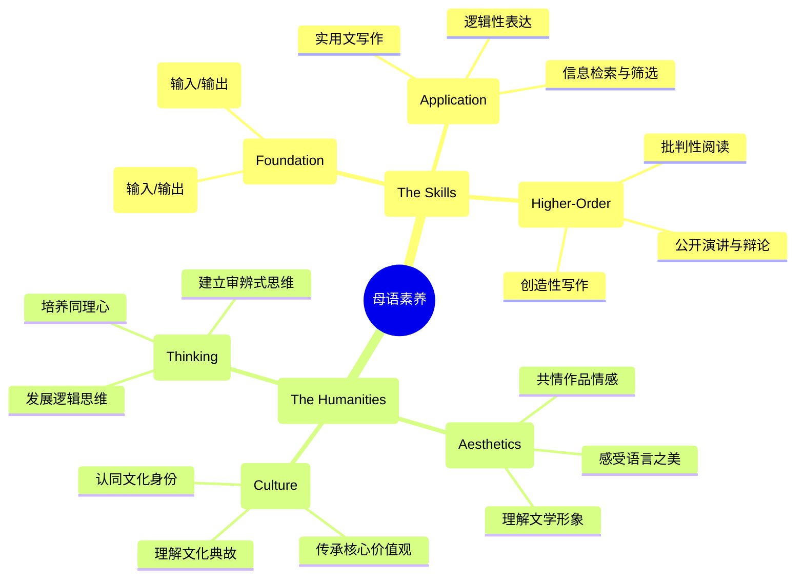

# 04-01 母语教育-知识图谱

## 核心概念关系图

## 图谱解读

1.  **中心节点：母语素养**
    - 这是现代母语教育的终极目标。它超越了单纯的"语文知识"或"读写技能"，是一个包含了**能力、情感、文化与思维**的综合体。一个拥有良好母语素养的人，不仅能高效地使用语言，更能通过语言理解世界、传承文化、安顿自身。

2.  **分支一：语言能力 (The Skills)**
    - 这是母语素养的"外在骨架"，是可观察、可训练、可评估的实践能力。它遵循着一个清晰的层级结构：
    - **基础技能**：听说读写是基石，是一切语言活动的基础。
    - **应用技能**：强调将基础技能用于解决真实世界的问题，例如写一封邮件、清晰地报告一件事、从海量信息中找到自己所需。这是"学以致用"的体现。
    - **高阶技能**：这是语言能力发展的顶端，与高阶思维紧密相连。它要求使用者不满足于"看懂"，更要"看透"（批判性阅读）；不满足于"写对"，更要"写好"（创造性写作）；不满足于"会说"，更要"善道"（演讲与辩论）。

3.  **分支二：人文素养 (The Humanities)**
    - 这是母语素养的"内在血肉"，是赋予语言以温度、深度和厚度的精神内核。它指向三个核心领域：
    - **文学审美**：强调母语教育的艺术属性。目标是引导学生从"读一个故事"走向"欣赏一部作品"，培养对语言文字的敏感和热爱。
    - **文化传承**：强调母语作为民族文化载体的功能。学习母语的过程，就是一次次走进本民族的历史与文化，建立身份认同和文化自信的过程。
    - **思维品质**：强调母语教育对心智的塑造作用。深度阅读和严谨写作，本身就是最好的逻辑训练；理解文学作品中复杂的人性，是培养同理心的最佳途径。母语教育最终要指向的是一个思维严谨、情感丰富、人格健全的现代公民。 