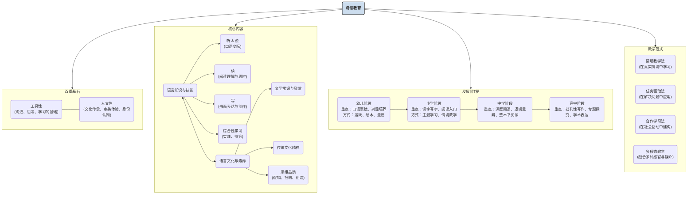

# 04-01-母语教育-知识图谱

## 母语教育核心概念图

## 图谱解读

该知识图谱旨在描绘"母语教育"的立体结构。

1.  **中心节点**：
    - **母语教育**：图谱的核心，它不仅仅是一门学科，更是个体社会化和心智成长的基础工程。

2.  **四大模块**：
    - **双重基石**：此模块揭示了母语教育的根本属性。它既有**工具性**，是其他一切学习、思考和交流的基础；又具有深刻的**人文性**，是个人构建文化身份、进行审美体验和传承民族精神的载体。任何偏废一方的教学，都是不完整的。
    - **核心内容**：此模块具体阐述了母语教育"教什么"。它分为两大交织的部分：一是**语言知识与技能**，即传统的"听说读写"能力；二是**语言文化与素养**，包括文学、文化以及更高阶的思维品质。二者紧密相连，技能是表达的手段，而文化与素养是表达的内涵与灵魂。
    - **发展阶梯**：此模块描绘了母语教育的纵向路径。它遵循学习者的认知发展规律，从**幼儿**阶段的兴趣培养和口语发展，到**小学**的读写基础，再到**中学**的深度阅读与思辨，最后到**高中**的批判性写作与探究，呈现出一个螺旋上升、难度与深度递进的阶梯。
    - **教学范式**：此模块展示了现代母语教育"怎么教"。它列举了四种主流的、以学生为中心的教学方法，如**情境教学法**、**任务驱动法**等。这些范式反对孤立的、机械的知识灌输，强调在真实的情境中、通过完成有意义的任务、借助多样的媒介和同伴的协作来学习语言。

总之，该图谱强调了母语教育是一个以"工具性"和"人文性"为根基，以"知识技能"和"文化素养"为内容，沿着认知阶梯，采用现代化教学范式来实施的复杂而系统的育人过程。 