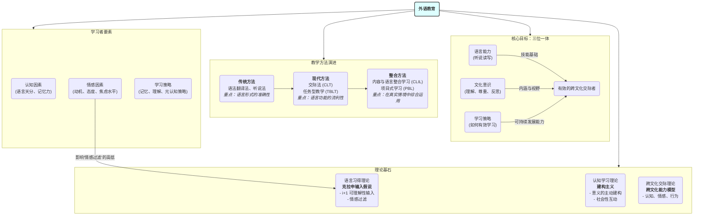

# 04-02-外语教育-知识图谱

## 外语教育核心概念图

## 图谱解读

该知识图谱旨在描绘"外语教育"的现代教学框架。

1. **中心节点**：
    - **外语教育**：其核心使命是培养能够在全球化背景下进行有效跨文化沟通的人才。

2. **四大模块**：
    - **核心目标**：现代外语教育追求的是一个"三位一体"的综合目标，而非单一的语言技能。它包括：熟练的**语言能力**、深刻的**文化意识**（不仅了解对方，也反思自身）以及高效的**学习策略**。这三者共同构成一个"有效的跨文化交际者"。
    - **理论基石**：指导外语教学实践的三大理论支柱。**语言习得理论**（特别是克拉申的假说）告诉我们，要在低焦虑的环境下提供大量"能听懂、但又稍有挑战"的语言输入。**认知学习理论**（特别是建构主义）强调学习是学生主动建构意义的过程，而非被动接受。**跨文化交际理论**则指明了教学内容不能局限于语言本身，必须包含文化认知、态度和行为的培养。
    - **教学方法演进**：此模块展示了外语教学理念的变迁。从**传统方法**对语言形式准确性的执着，到**现代方法**对语言功能和流利交际的重视，再到最新的**整合方法**，如CLIL和PBL，强调将语言学习融入到有意义的内容探究和项目解决中去。这个演进过程体现了从"教语言"到"用语言学"的转变。
    - **学习者要素**：最终的学习效果，很大程度上取决于学习者自身。图谱列出了影响学习的**认知因素**和**学习策略**，但尤其强调了**情感因素**。学生的动机、态度、自信和焦虑水平，直接决定了克拉申理论中"情感过滤"的高低，从而影响语言输入的吸收效率。因此，创造一个积极、支持、低焦虑的学习环境至关重要。

总之，该图谱呈现了一个以学习者为中心、以真实交际为目的、理论与实践紧密结合的现代外语教育观。
