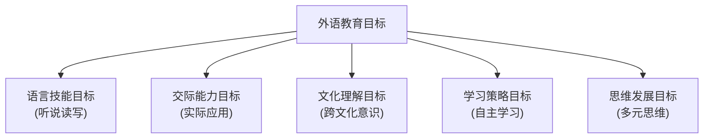
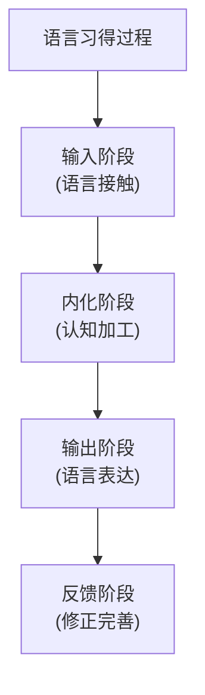
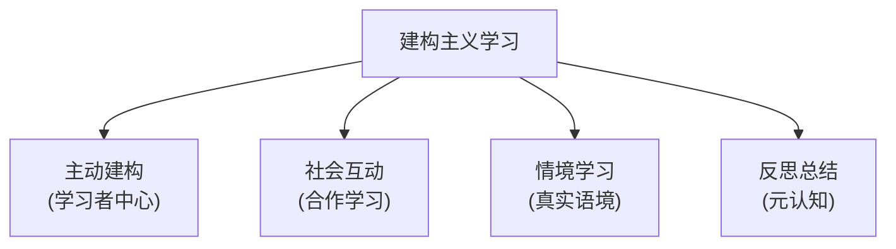
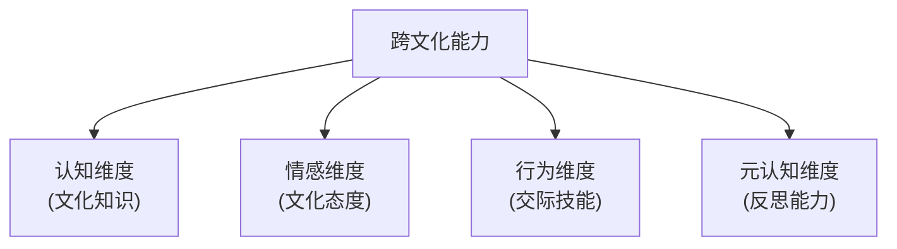
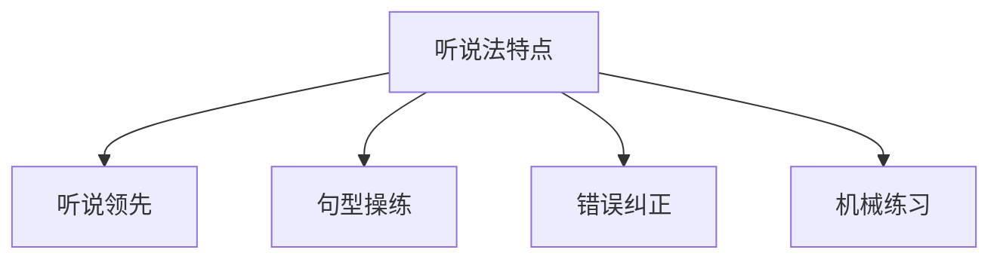
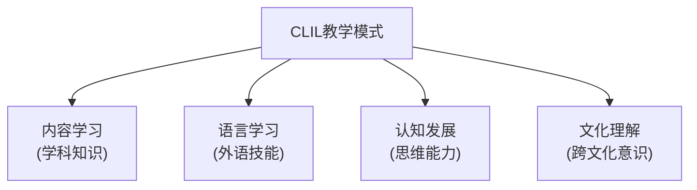
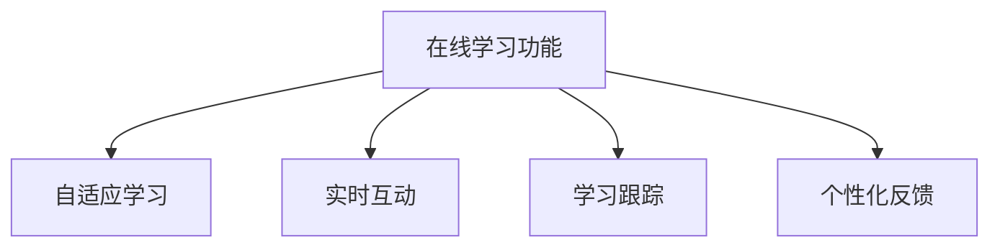

# 04-02-外语教育

## 1. 外语教育概述

### 1.1 外语教育的定义与意义

**外语教育**是指在学校教育体系中，有计划、有目的地教授和学习非母语语言的过程，旨在培养学生的外语交际能力和跨文化理解能力。

**教育意义**：

- 促进国际交流与合作
- 培养跨文化交际能力
- 提升国际竞争力
- 拓展认知视野和思维方式

### 1.2 外语教育的目标体系



## 2. 外语教育的理论基础

### 2.1 语言学习理论

**克拉申输入假说**：

- 可理解性输入
- 自然顺序假说
- 监控假说
- 情感过滤假说

**语言习得理论**：



### 2.2 认知学习理论

**信息加工理论**：

- 感觉记忆
- 工作记忆
- 长时记忆

**建构主义理论**：



### 2.3 跨文化交际理论

**文化适应理论**：

- 文化冲击阶段
- 文化适应阶段
- 文化融合阶段

**跨文化能力模型**：



## 3. 外语教学方法与策略

### 3.1 传统教学方法

**语法翻译法**：

- 重视语法规则
- 强调翻译练习
- 注重文学阅读

**直接法**：

- 全外语教学
- 直观教学
- 口语优先

**听说法**：



### 3.2 现代教学方法

**交际法**：

- 真实交际情境
- 任务型教学
- 意义优先

**内容与语言整合学习（CLIL）**：



**项目式学习（PBL）**：

- 真实项目任务
- 合作学习
- 成果展示

### 3.3 技术辅助教学

**多媒体教学**：

- 音频视频材料
- 互动软件
- 虚拟现实技术

**在线学习平台**：



```text
在线学习功能
├── 自适应学习
├── 实时互动
├── 学习跟踪
└── 个性化反馈
```

## 4. 外语课程设计

### 4.1 课程设计原则

**发展性原则**：

- 符合认知发展规律
- 循序渐进
- 螺旋式上升

**实用性原则**：

- 联系生活实际
- 注重交际应用
- 培养实用技能

**文化性原则**：

```text
文化融入方式
├── 文化知识介绍
├── 文化对比分析
├── 文化体验活动
└── 跨文化交际实践
```

### 4.2 课程内容结构

**语言知识**：

- 语音系统
- 词汇系统
- 语法系统
- 语篇系统

**语言技能**：

```text
语言技能培养
├── 听力理解（信息获取）
├── 口语表达（交际输出）
├── 阅读理解（文本理解）
└── 写作表达（书面输出）
```

**文化内容**：

- 目标语文化
- 本国文化
- 世界文化
- 跨文化比较

### 4.3 年级课程安排

```text
小学阶段（1-6年级）
├── 1-2年级：语音启蒙、基础词汇
├── 3-4年级：简单对话、基础语法
└── 5-6年级：短文阅读、简单写作

初中阶段（7-9年级）
├── 7年级：语法系统、交际技能
├── 8年级：文化理解、应用写作
└── 9年级：综合运用、跨文化交际

高中阶段（10-12年级）
├── 10年级：高级语法、文学阅读
├── 11年级：学术写作、文化研究
└── 12年级：专业英语、国际交流
```

## 5. 外语学习策略

### 5.1 认知策略

**记忆策略**：

- 联想记忆
- 分类记忆
- 重复记忆

**理解策略**：

```text
理解策略运用
├── 预测推理（上下文推测）
├── 关键词提取（重点信息）
├── 结构分析（语法结构）
└── 语境理解（情境推断）
```

### 5.2 元认知策略

**学习计划策略**：

- 目标设定
- 时间安排
- 方法选择

**监控调节策略**：

```text
监控调节过程
├── 学习过程监控
├── 学习效果评估
├── 策略调整优化
└── 错误分析修正
```

### 5.3 社会情感策略

**合作学习策略**：

- 同伴互助
- 小组讨论
- 角色扮演

**情感管理策略**：

- 学习动机维持
- 焦虑情绪调节
- 自信心建立

## 6. 外语教育评价体系

### 6.1 评价内容维度

**语言能力评价**：

- 语音准确性
- 词汇丰富性
- 语法正确性
- 语篇连贯性

**交际能力评价**：

```text
交际能力评估
├── 理解能力（听力阅读）
├── 表达能力（口语写作）
├── 互动能力（对话交流）
└── 适应能力（语境适应）
```

**文化能力评价**：

- 文化知识掌握
- 文化态度形成
- 跨文化交际技能

### 6.2 评价方法工具

**形成性评价**：

- 课堂观察
- 作业分析
- 学习档案
- 同伴评价

**总结性评价**：

```text
总结性评价方式
├── 标准化测试
├── 口语考试
├── 写作评估
└── 综合能力测试
```

**表现性评价**：

- 项目展示
- 角色扮演
- 文化展示
- 国际交流活动

## 7. 国际外语教育比较

### 7.1 欧洲外语教育

**欧洲语言共同参考框架（CEFR）**：

```text
CEFR能力等级
├── A1-A2：基础使用者
├── B1-B2：独立使用者
└── C1-C2：熟练使用者
```

**多语言教育政策**：

- 母语+两门外语
- 早期语言学习
- 内容与语言整合

### 7.2 美国外语教育

**5C标准**：

- Communication（交际）
- Cultures（文化）
- Connections（联系）
- Comparisons（比较）
- Communities（社区）

**沉浸式教学**：

- 全外语环境
- 学科内容教学
- 文化体验活动

### 7.3 亚洲外语教育

**新加坡双语教育**：

- 英语+母语
- 早期双语教育
- 国际化课程

**日本英语教育改革**：

- 小学英语必修
- 交际能力培养
- 国际理解教育

## 8. 外语教育发展趋势

### 8.1 技术融合趋势

**人工智能应用**：

- 智能语音识别
- 个性化学习系统
- 虚拟语言助手

**在线学习发展**：

```text
在线学习特点
├── 随时随地学习
├── 个性化定制
├── 实时互动反馈
└── 大数据分析
```

### 8.2 跨学科整合趋势

**学科融合教学**：

- 外语+科学
- 外语+历史
- 外语+艺术

**项目式学习**：

- 真实项目任务
- 跨学科知识整合
- 实践应用能力

### 8.3 国际化趋势

**国际课程引进**：

- IB课程
- A-Level课程
- AP课程

**国际交流合作**：

- 学生交换项目
- 教师培训合作
- 课程资源共享

## 9. 外语教育实施建议

### 9.1 教师专业发展

**专业知识更新**：

- 语言学理论
- 教学方法创新
- 文化知识拓展

**教学能力提升**：

```text
教学能力发展
├── 教学设计能力
├── 课堂管理能力
├── 评价反馈能力
└── 技术应用能力
```

### 9.2 学习环境优化

**物理环境建设**：

- 语言实验室
- 多媒体教室
- 文化体验中心

**虚拟环境构建**：

- 在线学习平台
- 虚拟语言社区
- 国际交流网络

### 9.3 质量保障机制

**课程标准建设**：

- 统一课程标准
- 分级能力标准
- 评价标准体系

**质量监控体系**：

- 定期评估检查
- 学生学习监测
- 教师教学反馈

---

*本文档为国际化基础教育体系项目的一部分，旨在提供系统性的外语教育指导，促进外语教育的科学化和国际化发展。*
