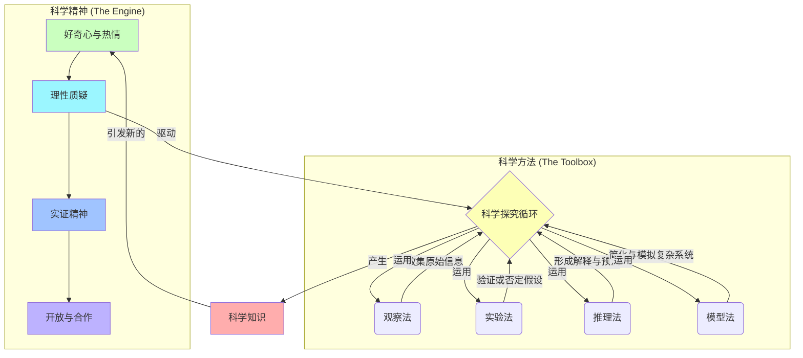

# 05-01 科学思维-知识图谱

## 核心概念关系图

## 图谱解读

这张知识图谱试图打破对"科学思维"的线性理解，展现其**循环和动态**的本质。

1.  **两大核心要素**
    -   图谱分为上下两大部分："**科学精神**"和"**科学方法**"。这揭示了科学思维的一体两面：它既是一套严谨的**操作工具**（方法），更是一种内化的**思维习惯和态度**（精神）。缺乏精神内核的方法是空洞的，而没有方法支撑的精神是空想。

2.  **科学精神 (The Engine)**
    -   这是驱动整个科学探究过程的**内在引擎**。
    -   **好奇心**是起点，是一切科学问题的源头。
    -   **理性质疑**是纠偏器，它要求我们不轻信、不盲从，对一切结论都问一句"证据是什么？"
    -   **实证精神**是压舱石，它强调一切猜想和理论，最终都必须接受现实世界中观察和实验的检验。
    -   **开放与合作**是加速器，承认个体认知的局限，愿意在交流、批评和协作中共同接近真理。

3.  **科学方法 (The Toolbox)**
    -   这是科学家和学习者在探究过程中可以使用的**外在工具箱**。
    -   **观察**是信息输入的基础；**实验**是因果关系验证的核心；**推理**（归纳与演绎）是构建理论解释的逻辑链条；**模型**是研究复杂、宏大或微观世界的重要捷径。
    -   这些方法不是孤立的，而是在探究循环中被综合、交替地使用。

4.  **科学探究循环 (The Loop)**
    -   图谱的中心是"**科学探究循环**"，它由"科学精神"所驱动，并在循环中调用"科学方法"这个工具箱。
    -   这个循环的过程大致是：由**好奇心**和**质疑**精神出发，通过**观察**和**推理**形成初步**假设**；然后设计**实验**或构建**模型**来验证假设；最终得出（阶段性的）**科学知识**。
    -   最关键的是，这个循环没有终点。新的**科学知识**会成为新的认知平台，并立刻引发**新的好奇心和质疑**，开启下一轮更高阶的探究循环。这完美地诠释了科学"永无止境、螺旋上升"的本质。 