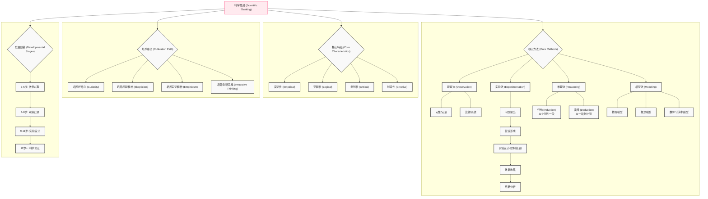

# 05-01-科学思维-知识图谱

本知识图谱旨在通过可视化的方式，系统梳理"科学思维"的构成要素、核心方法、培养路径与发展阶梯。

```mermaid
graph TD
    A["科学思维 (Scientific Thinking)"] --> B{"核心特征 (Core Characteristics)"};
    A --> C{"核心方法 (Core Methods)"};
    A --> D{"培养路径 (Cultivation Path)"};
    A --> E{"发展阶梯 (Developmental Stages)"};

    subgraph " "
    B --> B1["实证性 (Empirical)"];
    B --> B2["逻辑性 (Logical)"];
    B --> B3["批判性 (Critical)"];
    B --> B4["创造性 (Creative)"];
    end

    subgraph " "
    C --> C1["观察法 (Observation)"];
    C1 --- C1a["定性/定量"];
    C1 --- C1b["比较/系统"];

    C --> C2["实验法 (Experimentation)"];
    C2 --- C2a["问题提出"];
    C2a --> C2b["假设形成"];
    C2b --> C2c["实验设计(控制变量)"];
    C2c --> C2d["数据收集"];
    C2d --> C2e["结果分析"];

    C --> C3["推理法 (Reasoning)"];
    C3 --- C3a["归纳 (Induction)<br/>从个别到一般"];
    C3 --- C3b["演绎 (Deduction)<br/>从一般到个别"];

    C --> C4["模型法 (Modeling)"];
    C4 --- C4a["物理模型"];
    C4 --- C4b["概念模型"];
    C4 --- C4c["数学/计算机模型"];
    end

    subgraph " "
    D --> D1["培养好奇心 (Curiosity)"];
    D --> D2["培养质疑精神 (Skepticism)"];
    D --> D3["培养实证精神 (Empiricism)"];
    D --> D4["培养创新思维 (Innovative Thinking)"];
    end

    subgraph " "
    E --> E1["3-5岁: 激发兴趣"];
    E1 --> E2["6-8岁: 观察记录"];
    E2 --> E3["9-11岁: 实验设计"];
    E3 --> E4["12岁+: 科学论证"];
    end

    classDef default fill:#f9f9f9,stroke:#333,stroke-width:2px;
    classDef pink fill:#ffeaef,stroke:#ff80a4,stroke-width:2px;

    class A pink;
``` 