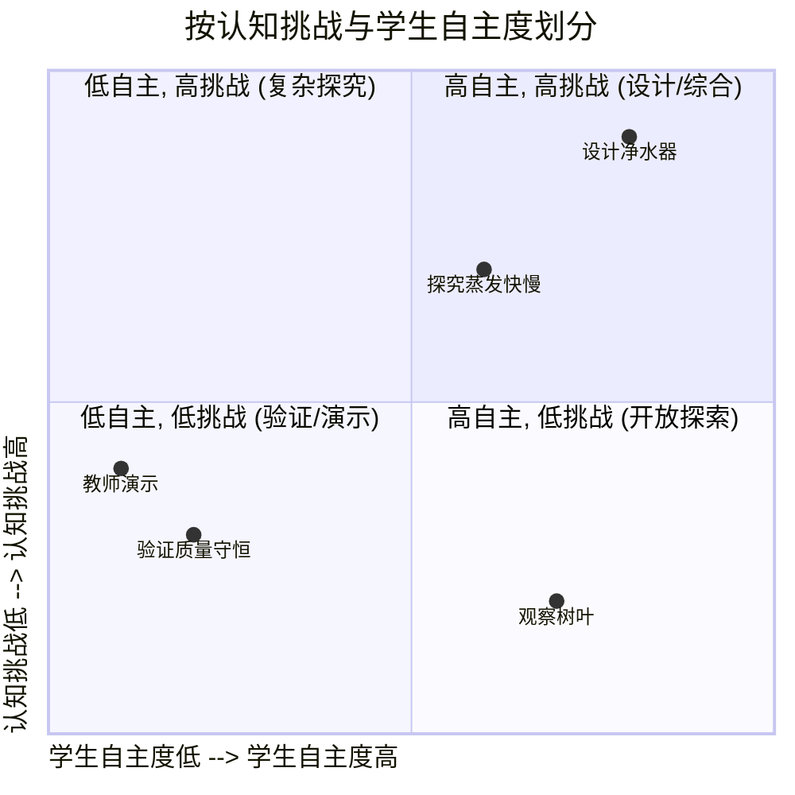

# 05-02-科学实验教学-教材素材

本文档提供一系列可供教师直接使用的教学设计工具、学生工作单和评估框架，以支持高质量的科学实验教学。

---

### 1. 教师用：实验教学设计工具

#### a. 实验教学设计四象限

**使用说明**: 这是一个帮助教师规划和审视一学期或一学年实验教学多样性的工具。理想的教学设计应覆盖所有象限，并引导学生逐步从左下角走向右上角。

- **第三象限 (验证/演示)**: 学生按指令操作，认知负荷低。适合入门和概念验证。
- **第二象限 (复杂探究)**: 教师设定问题和大部分流程，但分析和结论需要较高思维能力。
- **第四象限 (开放探索)**: 学生有较高自由度，但任务本身的认知复杂度不高，重在激发兴趣。
- **第一象限 (设计/综合)**: 终极目标。学生需自主完成从提出问题到设计、执行、分析的全过程，认知挑战最高。

---

### 2. 学生用：探究与报告工具

#### a. 通用探究式实验设计工作纸 (POWDER-C)

**P - Problem/Question - 问题**:
> 我们要探究的问题是什么？
>

**O - Observation/Research - 观察/研究**:
> 关于这个问题，我们已经知道了什么？我们观察到了什么现象？
>

**W - What's my hypothesis? - 我的假设**:
> 根据已知信息，我预测结果会是... 因为...
>

**D - Design the experiment - 实验设计**:
>
> - 自变量 (我改变的):
> - 因变量 (我测量的):
> - 控制变量 (保持不变的):
>
> **风险评估**: 这个实验有什么潜在危险？我将如何预防？
>

**E - Execution & Evidence - 执行与证据**:
> **步骤**: (简要写下你的操作步骤)
>
> **数据/证据**: (在此处绘制表格、粘贴图片或记录观察)
>

**R - Reasoning & Conclusion - 推理与结论**:
> 使用下面的 C-E-R 框架来撰写结论。

#### b. C-E-R 结论写作框架

- **Claim (我的主张)**: (用一句话直接回答你最初的问题)
  >
- **Evidence (我的证据)**: (引用你收集到的具体数据和观察结果来支持你的主张)
  >
- **Reasoning (我的推理)**: (解释为什么你的证据能支持你的主张，并把证据和相关的科学原理联系起来)
  >

---

### 3. 通用清单与提示卡

#### a. 实验安全自查清单 (学生版)

**在开始实验前，请确认你已经做到：**

- [ ] 我已经仔细阅读并理解了本次实验的所有步骤。
- [ ] 我知道本次实验中潜在的风险（如烫伤、腐蚀、易碎品）。
- [ ] 我已穿戴好必要的防护用品（如护目镜、实验服）。
- [ ] 我已将长发束在脑后，并整理好宽松的衣物。
- [ ] 我知道教室里的消防器材（灭火器、消防栓）和紧急冲淋装置的位置。
- [ ] 我保持实验台整洁，只放置与本次实验相关的物品。
- [ ] 我知道如何正确处理实验废弃物。
- [ ] 如果我不确定任何步骤，我会先举手问老师，而不是自己尝试。

#### b. 实验反思提示卡

**实验结束后，和你的小组成员一起讨论或在你的日志中回答这些问题：**

1. **关于结果**:
    - 我们的结果是预期的吗？为什么？
    - 我们的数据中有什么"奇怪"或"异常"的地方吗？它们可能说明了什么？
2. **关于过程**:
    - 在实验中，我们遇到的最大挑战是什么？我们是如何解决的？
    - 如果可以重做一次，我们会对实验设计或操作步骤做出什么改变？为什么？
3. **关于思考**:
    - 这次实验验证/推翻了我们的哪些原有想法？
    - 做完这个实验，我们又产生了哪些新的问题？
    - 我们今天学到的知识或技能，可以应用到生活中的哪个场景？
