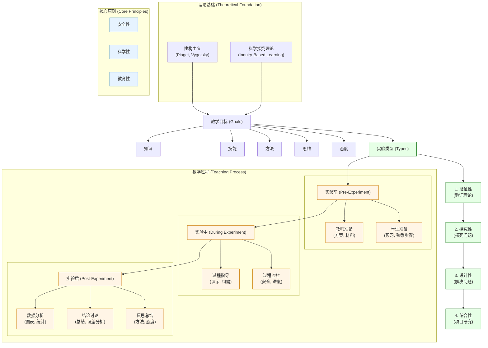

# 05-02-科学实验教学-知识图谱

本知识图谱通过流程图的形式，系统性地梳理了科学实验教学的理论基础、核心目标、主要类型、实施过程及关键原则。

```mermaid
graph TD
    subgraph "理论基础 (Theoretical Foundation)"
        A1["建构主义<br/>(Piaget, Vygotsky)"];
        A2["科学探究理论<br/>(Inquiry-Based Learning)"];
    end

    subgraph "核心原则 (Core Principles)"
        P1["安全性"];
        P2["科学性"];
        P3["教育性"];
    end

    subgraph "教学过程 (Teaching Process)"
        D["实验前 (Pre-Experiment)"] --> E["实验中 (During Experiment)"] --> F["实验后 (Post-Experiment)"];
        
        subgraph " "
        D --> D1["教师准备<br/>(方案, 材料)"];
        D --> D2["学生准备<br/>(预习, 熟悉步骤)"];
        end

        subgraph " "
        E --> E1["过程指导<br/>(演示, 纠偏)"];
        E --> E2["过程监控<br/>(安全, 进度)"];
        end

        subgraph " "
        F --> F1["数据分析<br/>(图表, 统计)"];
        F --> F2["结论讨论<br/>(总结, 误差分析)"];
        F --> F3["反思总结<br/>(方法, 态度)"];
        end
    end

    B["教学目标 (Goals)"] --> B1["知识"];
    B --> B2["技能"];
    B --> B3["方法"];
    B --> B4["思维"];
    B --> B5["态度"];

    C["实验类型 (Types)"] --> C1["1. 验证性<br/>(验证理论)"];
    C1 --> C2["2. 探究性<br/>(探究问题)"];
    C2 --> C3["3. 设计性<br/>(解决问题)"];
    C3 --> C4["4. 综合性<br/>(项目研究)"];
    
    A1 & A2 --> B;
    B --> C;
    C --> D;
    
    classDef principles fill:#e6f3ff,stroke:#0066cc;
    class P1,P2,P3 principles;

    classDef types fill:#e6ffe6,stroke:#006600;
    class C,C1,C2,C3,C4 types;
    
    classDef process fill:#fff5e6,stroke:#cc7a00;
    class D,E,F,D1,D2,E1,E2,F1,F2,F3 process;

```
