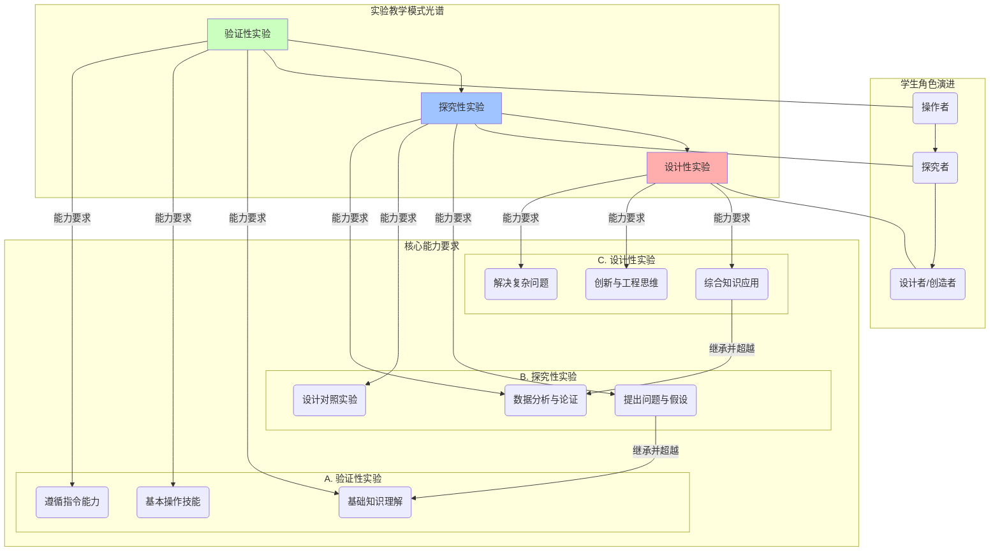

# 05-02-科学实验教学-知识图谱

## 核心概念关系图

## 图谱解读

这张知识图谱将不同的实验教学模式，视为一个连续的、递进的**光谱**，而非几种孤立的类型。它旨在揭示随着实验模式的演进，对学生能力的要求以及学生在其中扮演的角色是如何变化的。

1.  **光谱的核心：三种实验模式**
    -   **验证性实验**：这是光谱的**基础端**。其核心目标是"证实已知"，帮助学生将理论知识与感官经验建立连接。它重在"理解"和"复制"。
    -   **探究性实验**：这是光谱的**中间地带**。其核心目标是"发现未知"，学生需要像侦探一样，通过设计和执行实验来回答一个没有现成答案的问题。它重在"过程"和"论证"。
    -   **设计性实验**：这是光谱的**高端**。其核心目标是"创造新物"，学生需要像工程师一样，综合运用所有知识来设计一个解决方案或产品。它重在"应用"和"创新"。

2.  **能力要求的递进**
    -   图谱清晰地显示，从验证性到设计性，对学生核心能力的要求是**层层递加、不断拓展**的。
    -   在**验证性**阶段，核心要求是学生能**听懂指令、规范操作**，是一个合格的"执行者"。
    -   进入**探究性**阶段，能力要求发生了质变。学生需要开始独立思考：**如何提出一个好问题？如何设计一个公平的比较？如何让证据说话？** 这要求学生具备初步的科学思维能力。
    -   到达**设计性**阶段，能力要求达到顶峰。它不再是回答一个问题，而是**解决一个开放性的、复杂的挑战**。这要求学生能够灵活、综合、创造性地调动所有知识储备。

3.  **学生角色的演进**
    -   与能力要求相对应，学生在不同模式实验中扮演的角色也在不断**演进**。
    -   在验证性实验中，学生是知识的**操作者 (Operator)**，主要任务是准确地执行预设的流程。
    -   在探究性实验中，学生是问题的**探究者 (Investigator)**，他们是学习过程的主导者，主动寻找答案。
    -   在设计性实验中，学生是方案的**设计者/创造者 (Designer/Creator)**，他们是知识的应用者和新事物的制造者。

一个完善的科学教育体系，应该为学生提供光谱两端完整的体验，既要有扎实的验证性实验来夯实基础，也要有足够开放的探究和设计性实验来拔高能力、激发创新。 