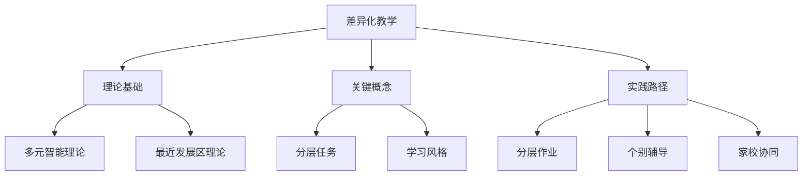

# 06-01 差异化教学-知识图谱

## 1. 主题简介

本知识图谱梳理差异化教学的核心概念、理论基础、实践路径及其相互关系，帮助教师、家长和学生系统理解该主题。

## 2. 理论基础

- 多元智能理论
- 最近发展区理论
- 国际差异化教学经验

## 3. 关键概念与定义

| 概念 | 定义 |
|------|------|
| 差异化教学 | 针对学生差异调整教学内容、方法和评价 |
| 分层任务 | 针对不同能力层次设计的学习任务 |
| 个性化辅导 | 针对个体需求的专门指导 |

## 4. 知识图谱结构

## 5. 教学建议

- 教师：利用知识图谱梳理教学思路
- 家长：参考图谱支持家庭教育
- 学生：通过图谱自查学习进展

## 6. 相关资源与拓展

- 推荐工具：XMind、MindMaster
- 相关主题：[06-01-差异化教学-案例](./06-01-差异化教学-案例.md)

---

> 本文档为自动生成内容草案，后续可根据实际教学与研究需要补充完善。
