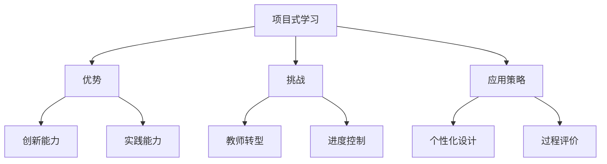

# 06-02 项目式学习-批判性分析

## 1. 主题简介

项目式学习作为一种以学生为中心的教学方法，强调通过真实项目培养学生的综合能力，但在实际应用中也需要审慎思考和批判性反思。

## 2. 理论基础

- 建构主义学习理论
- 问题驱动学习（PBL）
- 国际项目式学习经验

## 3. 关键概念

| 概念 | 解释 |
|------|------|
| 项目式学习 | 以真实项目为载体的综合性学习方法 |
| 问题驱动 | 以实际问题引发学习兴趣 |
| 合作探究 | 团队协作完成项目任务 |

## 4. 批判性分析

### 优势

- 激发学生主动性和创新精神
- 培养综合能力和实践技能
- 促进学科融合与深度学习

### 挑战

- 教师角色转变难度大，需要高水平设计能力
- 项目周期长，难以控制教学进度
- 评价体系复杂，过程性成果难以量化
- 学生基础差异大，部分学生易掉队

### 国际比较

- 美国、芬兰等国家在项目式学习方面经验丰富
- 国内项目式学习多处于试点阶段，需加强教师培训

## 5. 案例分析

- 美国High Tech High学校的项目式学习实践
- 芬兰现象课程中的跨学科项目设计

## 6. 多表征分析

## 7. 教学建议

- 加强教师专业发展，提升项目设计能力
- 合理安排项目周期，关注学生差异化支持
- 建立多元评价体系，重视过程性成果
- 借鉴国际经验，结合本土实际创新实践

## 8. 推荐资源

- 国际项目式学习案例库
- 项目式学习设计相关书籍
- [06-02-项目式学习-案例](./06-02-项目式学习-案例.md)

---

> 本文档为自动生成内容草案，欢迎教师结合实际教学进一步完善。
