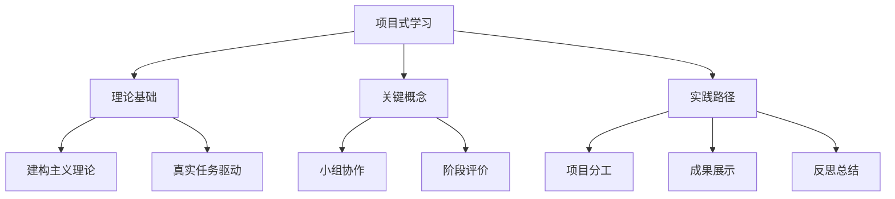

# 06-02 项目式学习-知识图谱

## 1. 主题简介

本知识图谱梳理项目式学习的核心概念、理论基础、实践路径及其相互关系，帮助教师、家长和学生系统理解该主题。

## 2. 理论基础

- 建构主义理论
- 真实任务驱动
- 国际PBL经验

## 3. 关键概念与定义

| 概念 | 定义 |
|------|------|
| 项目式学习 | 以项目为中心的探究式学习 |
| 小组协作 | 多人合作完成任务 |
| 阶段评价 | 按项目进度进行评价 |

## 4. 知识图谱结构

## 5. 教学建议

- 教师：利用知识图谱梳理项目设计思路
- 家长：参考图谱参与家庭项目
- 学生：通过图谱自查项目进展

## 6. 相关资源与拓展

- 推荐工具：XMind、MindMaster
- 相关主题：[06-02-项目式学习-案例](./06-02-项目式学习-案例.md)

---

> 本文档为自动生成内容草案，后续可根据实际教学与研究需要补充完善。
