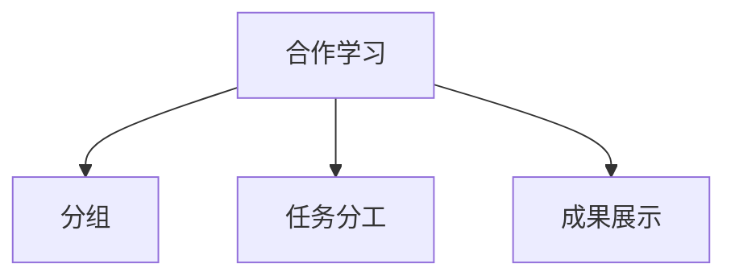

# 06-03 合作学习-批判性分析

## 1. 主题简介
合作学习是一种以小组为单位，通过成员间的互动与协作，共同完成学习任务、提升认知与社会能力的教学模式。

## 2. 理论基础
- 维果茨基社会建构主义理论
- 约翰逊合作学习理论
- 国际合作学习模式（如Jigsaw拼图法、STAD等）

## 3. 关键概念与定义
| 概念 | 定义 | 例子 |
|------|------|------|
| 合作学习 | 学生共同完成学习任务的过程 | 小组讨论、项目合作 |
| 角色分工 | 每个成员承担不同任务 | 组长、记录员、发言人 |

## 4. 实践案例
- 小学科学小组实验合作
- 新加坡合作学习课堂
- 家庭成员协作完成家庭项目

## 5. 多表征分析

## 6. 教学建议
- 教师：合理分组，明确分工，促进小组互动
- 家长：鼓励家庭成员合作，参与亲子项目
- 学生：主动承担角色，积极参与小组活动

## 7. 相关资源与拓展
- 推荐书籍：《合作学习的力量》
- 相关主题：[06-03-合作学习-教师版](../教师版/06-03-合作学习-教师版.md)

---

> 本文档为自动生成内容草案，后续可根据实际教学与研究需要补充完善。 