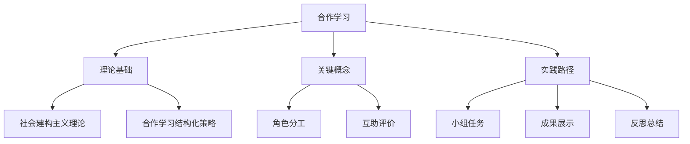

# 06-03 合作学习-知识图谱

## 1. 主题简介
本知识图谱梳理合作学习的核心概念、理论基础、实践路径及其相互关系，帮助教师、家长和学生系统理解该主题。

## 2. 理论基础
- 社会建构主义理论
- 合作学习结构化策略
- 国际合作学习经验

## 3. 关键概念与定义
| 概念 | 定义 |
|------|------|
| 合作学习 | 学生共同完成学习任务的过程 |
| 角色分工 | 每个成员承担不同任务 |
| 互助评价 | 小组成员互相评价表现 |

## 4. 知识图谱结构

## 5. 教学建议
- 教师：利用知识图谱梳理合作学习设计思路
- 家长：参考图谱参与家庭合作
- 学生：通过图谱自查合作进展

## 6. 相关资源与拓展
- 推荐工具：XMind、MindMaster
- 相关主题：[06-03-合作学习-案例](./06-03-合作学习-案例.md)

---

> 本文档为自动生成内容草案，后续可根据实际教学与研究需要补充完善。 