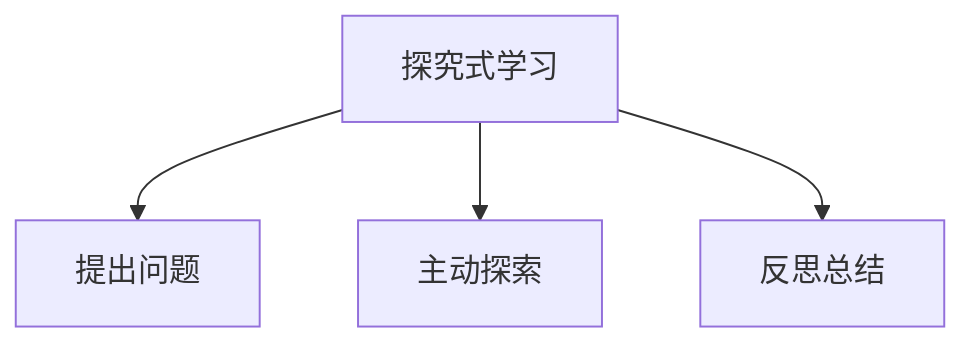

# 06-04 探究式学习-批判性分析

## 1. 主题简介

探究式学习是一种以学生为中心，通过提出问题、主动探索和反思总结，促进深度理解和创新能力发展的教学模式。

## 2. 理论基础

- 皮亚杰建构主义理论
- 布鲁纳发现学习理论
- 国际探究式学习实践（如IB课程、芬兰现象教学等）

## 3. 关键概念与定义

| 概念 | 定义 | 例子 |
|------|------|------|
| 探究式学习 | 以问题为导向的主动学习过程 | 科学实验、社会调研 |
| 问题驱动 | 以真实问题引发学习兴趣 | 设计水循环实验 |

## 4. 实践案例

- IB课程中的探究单元
- 芬兰现象教学课堂
- 中国小学科学探究活动

## 5. 多表征分析

## 6. 教学建议

- 教师：引导学生提出问题，设计探究活动
- 家长：鼓励孩子自主探索，支持家庭实验
- 学生：主动思考，积极参与探究过程

## 7. 相关资源与拓展

- 推荐书籍：《探究式学习的力量》
- 相关主题：[06-04-探究式学习-教师版](../教师版/06-04-探究式学习-教师版.md)

---

> 本文档为自动生成内容草案，后续可根据实际教学与研究需要补充完善。
