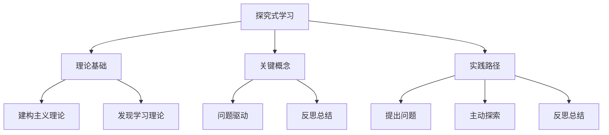

# 06-04 探究式学习-知识图谱

## 1. 主题简介
本知识图谱梳理探究式学习的核心概念、理论基础、实践路径及其相互关系，帮助教师、家长和学生系统理解该主题。

## 2. 理论基础
- 建构主义理论
- 发现学习理论
- 国际探究式学习经验

## 3. 关键概念与定义
| 概念 | 定义 |
|------|------|
| 探究式学习 | 以问题为导向的主动学习过程 |
| 问题驱动 | 以真实问题引发学习兴趣 |
| 反思总结 | 对学习过程和结果的回顾 |

## 4. 知识图谱结构

## 5. 教学建议
- 教师：利用知识图谱梳理探究活动设计思路
- 家长：参考图谱参与家庭探究
- 学生：通过图谱自查探究进展

## 6. 相关资源与拓展
- 推荐工具：XMind、MindMaster
- 相关主题：[06-04-探究式学习-案例](./06-04-探究式学习-案例.md)

---

> 本文档为自动生成内容草案，后续可根据实际教学与研究需要补充完善。 