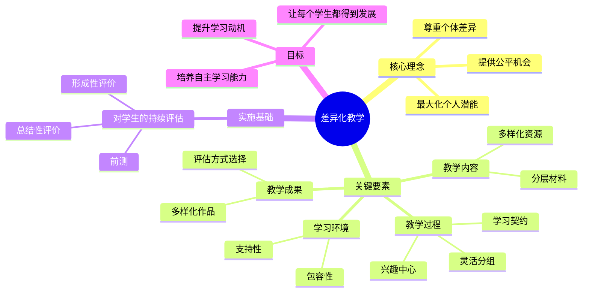

# 差异化教学-知识图谱

本知识图谱旨在通过可视化的方式，系统地呈现差异化教学的核心理念、关键要素、实施基础及其最终目标。

```mermaid
mindmap
  root((差异化教学))
    ::icon(fa fa-chalkboard-teacher)
    核心理念
      ::icon(fa fa-heart)
      尊重个体差异
      提供公平机会
      最大化个人潜能
    关键要素
      ::icon(fa fa-cogs)
      教学内容
        分层材料
        多样化资源
      教学过程
        灵活分组
        学习契约
        兴趣中心
      教学成果
        多样化作品
        评估方式选择
      学习环境
        支持性
        包容性
    实施基础
      ::icon(fa fa-user-check)
      对学生的持续评估
        前测
        形成性评价
        总结性评价
    目标
      ::icon(fa fa-bullseye)
      让每个学生都得到发展
      提升学习动机
      培养自主学习能力
```
