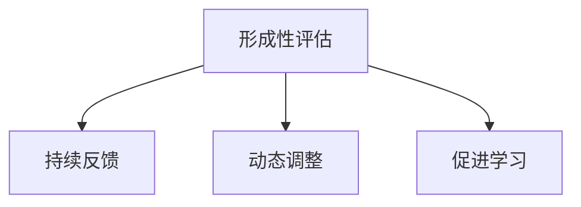

# 07-01 形成性评估-批判性分析

## 1. 主题简介

形成性评估是一种在教学过程中持续进行、以促进学生学习和教师改进教学为目标的评价方式。

## 2. 理论基础

- 建构主义学习理论
- 反馈与调节理论
- 国际形成性评估实践（如英国AfL、美国标准本位评估等）

## 3. 关键概念与定义

| 概念 | 定义 | 例子 |
|------|------|------|
| 形成性评估 | 教学过程中持续收集和利用信息促进学习 | 课堂提问、作业反馈 |
| 反馈调节 | 通过反馈调整学习和教学 | 口头点评、同伴互评 |

## 4. 实践案例

- 英国小学AfL课堂反馈
- 美国标准本位形成性评价
- 中国课堂即时提问与纠错

## 5. 多表征分析

## 6. 教学建议

- 教师：设计多样化评价方式，及时反馈
- 家长：关注孩子学习过程，参与家庭评价
- 学生：主动反思学习，参与自评互评

## 7. 相关资源与拓展

- 推荐书籍：《形成性评价的力量》
- 相关主题：[07-01-形成性评估-教师版](../教师版/07-01-形成性评估-教师版.md)

---

> 本文档为自动生成内容草案，后续可根据实际教学与研究需要补充完善。
