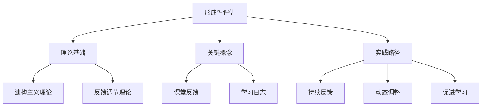

# 07-01 形成性评估-知识图谱

## 1. 主题简介

本知识图谱梳理形成性评估的核心概念、理论基础、实践路径及其相互关系，帮助教师、家长和学生系统理解该主题。

## 2. 理论基础

- 建构主义理论
- 反馈调节理论
- 国际形成性评估经验

## 3. 关键概念与定义

| 概念 | 定义 |
|------|------|
| 形成性评估 | 教学过程中持续收集和利用信息促进学习 |
| 课堂反馈 | 教师对学生的即时评价 |
| 学习日志 | 学生自主记录学习过程的工具 |

## 4. 知识图谱结构



## 5. 教学建议

- 教师：利用知识图谱梳理评价设计思路
- 家长：参考图谱参与家庭评价
- 学生：通过图谱自查学习进展

## 6. 相关资源与拓展

- 推荐工具：XMind、MindMaster
- 相关主题：[07-01-形成性评估-案例](./07-01-形成性评估-案例.md)

---

> 本文档为自动生成内容草案，后续可根据实际教学与研究需要补充完善。

```mermaid
graph TD
    subgraph 核心理念 (Why)
        A["形成性评估<br/>(Formative Assessment)"]
        A --> B("<strong>核心目标:</strong><br/>将评估作为促进学习的手段<br/>Assessment FOR Learning")
        B --> C("理念1: 学习是持续发展的过程")
        B --> D("理念2: 反馈是教与学调整的催化剂")
        B --> E("理念3: 学生是自身学习的主人")
    end

    subgraph 关键要素 (What)
        F("五大关键策略")
        F --> G("1. 澄清、分享和理解学习意图")
        F --> H("2. 采取有效策略引发学习证据")
        F --> I("3. 提供能够推动学习的反馈")
        F --> J("4. 激活学生作为彼此的学习资源")
        F --> K("5. 激活学生作为自身学习的主人")
    end

    subgraph 实施循环与方法 (How)
        subgraph 实施循环 (The Loop)
            L["1. 收集证据<br/>(Gather Evidence)"] --> M["2. 解释证据<br/>(Interpret Evidence)"]
            M --> N["3. 采取行动<br/>(Take Action)"]
            N --> O["4. 调整教与学<br/>(Adjust Teaching & Learning)"]
            O --> L
        end
        subgraph 具体方法 (Methods)
            P("方法库")
            P --> P1("课堂提问")
            P --> P2("学习观察")
            P --> P3("出口票/入门票")
            P --> P4("迷你白板")
            P --> P5("同伴/自我评估")
            P --> P6("学习日志")
        end
    end

    subgraph 终极目标 (Ultimate Goal)
        Q("赋能学习者<br/>(Empowered Learner)")
        Q --> Q1("具备评估素养")
        Q --> Q2("成为终身学习者")
    end

    %% 连接关系
    A -- 理论基础 --> F
    F -- 指导实践 --> L
    L -- 具体化 --> P
    E -- 培养目标 --> Q
    K -- 培养目标 --> Q
    O -- 导向 --> Q
```
