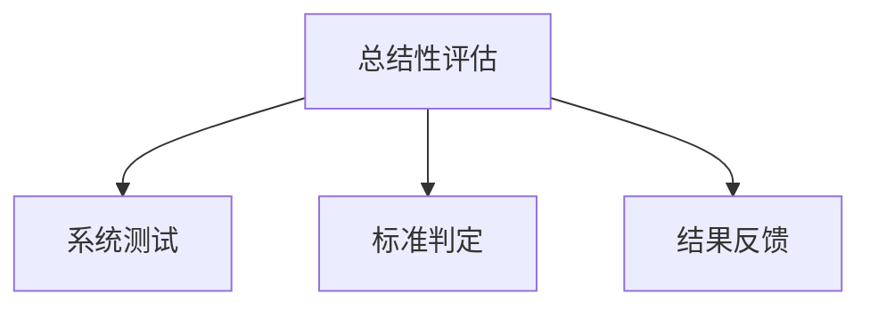

# 07-02 总结性评估-批判性分析

## 1. 主题简介

总结性评估是指在学习阶段结束时，对学生学习成果进行系统性、全面性评价的方式，常用于判定学生是否达成学习目标。

## 2. 理论基础

- 教育测量与评价理论
- 标准本位评价理论
- 国际总结性评估实践（如PISA、SAT等）

## 3. 关键概念与定义

| 概念 | 定义 | 例子 |
|------|------|------|
| 总结性评估 | 阶段性结束时的系统性评价 | 期末考试、等级测试 |
| 标准本位 | 以预设标准判定学习达成度 | 课程目标达成度分析 |

## 4. 实践案例

- PISA国际学生评估项目
- 中国中高考总结性评价
- 美国SAT考试

## 5. 多表征分析

## 6. 教学建议

- 教师：科学设计测试，关注多元评价
- 家长：理性看待成绩，关注过程成长
- 学生：总结反思，制定改进计划

## 7. 相关资源与拓展

- 推荐书籍：《教育测量与评价》
- 相关主题：[07-02-总结性评估-教师版](../教师版/07-02-总结性评估-教师版.md)

---

> 本文档为自动生成内容草案，后续可根据实际教学与研究需要补充完善。
