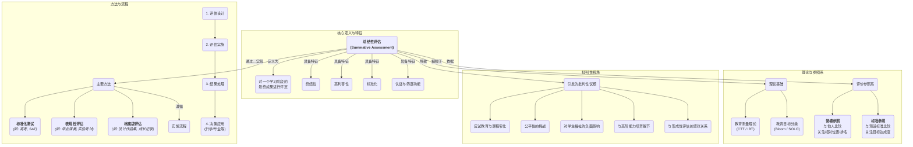

# 07-02 总结性评估：知识图谱

本知识图谱旨在系统性地呈现总结性评估的框架。图谱以总结性评估的定义为中心，辐射至其核心特征、理论基础、关键方法、实施流程，并关联到其引发的主要批判性议题，从而提供一个全面的理解视角。

```mermaid
graph TD
    subgraph 核心定义与特征
        A("<b>总结性评估<br/>(Summative Assessment)</b>")
        A --"定义为"--> A1("对一个学习阶段的<br/>最终成果进行评定")
        A --"具备特征"--> F1("终结性")
        A --"具备特征"--> F2("高利害性")
        A --"具备特征"--> F3("标准化")
        A --"具备特征"--> F4("认证与筛选功能")
    end

    subgraph 理论与参照系
        B("理论基础")
        B --> B1("教育测量理论<br>(CTT / IRT)")
        B --> B2("教育目标分类<br>(Bloom / SOLO)")
        
        C("评价参照系")
        C --> C1("<b>常模参照</b><br>与他人比较<br>关注相对位置/排名")
        C --> C2("<b>标准参照</b><br>与预设标准比较<br>关注目标达成度")
    end

    subgraph 方法与流程
        D("主要方法")
        D --> D1("<b>标准化测试</b><br><i>(如: 高考, SAT)</i>")
        D --> D2("<b>表现性评估</b><br><i>(如: 毕业演奏, 实验考试)</i>")
        D --> D3("<b>档案袋评估</b><br><i>(如: 设计作品集, 成长记录)</i>")
        
        E("实施流程")
        E1("1. 评估设计") --> E2("2. 评估实施")
        E2 --> E3("3. 结果处理") --> E4("4. 决策应用<br>(升学/毕业等)")
    end

    subgraph 批判性视角
        G("引发的批判性议题")
        G --> G1("应试教育与课程窄化")
        G --> G2("公平性的挑战")
        G --> G3("对学生福祉的负面影响")
        G --> G4("与高阶能力培养脱节")
        G --> G5("与形成性评估的紧张关系")
    end

    %% 全局关系
    A --"植根于"--> B
    A --"依据"--> C
    A --"通过...实现"--> D
    D --"遵循"--> E
    A --"导致"--> G
``` 