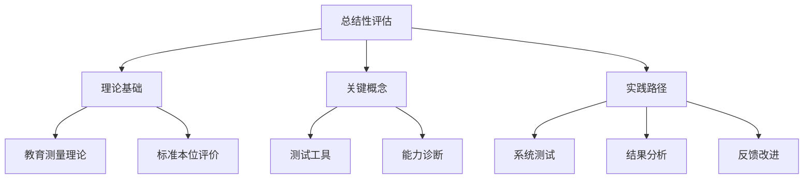

# 07-02 总结性评估-知识图谱

## 1. 主题简介

本知识图谱梳理总结性评估的核心概念、理论基础、实践路径及其相互关系，帮助教师、家长和学生系统理解该主题。

## 2. 理论基础

- 教育测量理论
- 标准本位评价
- 国际总结性评估经验

## 3. 关键概念与定义

| 概念 | 定义 |
|------|------|
| 总结性评估 | 阶段性结束时的系统性评价 |
| 测试工具 | 用于评价学习成果的工具 |
| 能力诊断 | 通过测试分析学生能力 |

## 4. 知识图谱结构

## 5. 教学建议

- 教师：利用知识图谱梳理评价设计思路
- 家长：参考图谱参与家庭分析
- 学生：通过图谱自查学习进展

## 6. 相关资源与拓展

- 推荐工具：XMind、MindMaster
- 相关主题：[07-02-总结性评估-案例](./07-02-总结性评估-案例.md)

---

> 本文档为自动生成内容草案，后续可根据实际教学与研究需要补充完善。
