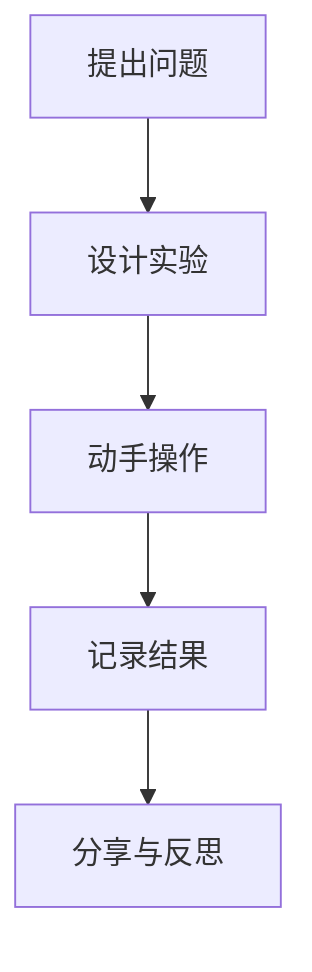

# 08-02 探索式学习设计-学生版-批判性分析

## 1. 主题简介
探索式学习是一种鼓励我们主动提问、动手实验、合作探究的学习方式，但在实际学习中也会遇到一些挑战。

## 2. 理论基础
- 建构主义：通过亲身体验和思考获得知识。
- 问题驱动：学习从一个有趣的问题开始。

## 3. 关键概念
| 概念 | 解释 |
|------|------|
| 探索 | 主动发现和研究新事物 |
| 合作 | 和同学一起完成任务 |
| 反思 | 回顾学习过程和收获 |

## 4. 批判性分析
### 优点
- 能激发我们的好奇心和学习兴趣
- 培养动手能力和创新思维
- 学会与同学合作、表达自己的想法

### 挑战
- 有时会觉得没有明确答案，容易迷茫
- 需要花更多时间思考和实验
- 小组合作时可能会有分歧，需要学会沟通

### 解决建议
- 主动向老师和同学请教，遇到困难不放弃
- 合理安排时间，分阶段完成探索任务
- 学会倾听和表达，尊重不同意见

## 5. 案例故事
- 在"水为什么会蒸发？"的实验中，我们遇到数据不一致，通过讨论和查资料找到原因，最后顺利完成实验。

## 6. 多表征展示

## 7. 学习建议
- 勇敢提问，积极参与小组讨论
- 多动手实践，遇到困难多思考
- 善于总结经验，持续改进学习方法

## 8. 推荐资源
- 科学小实验书籍
- 探索类动画片
- [08-02-探索式学习设计-学生版-案例](./08-02-探索式学习设计-学生版-案例.md)

---

> 本文档为自动生成内容草案，欢迎同学们补充自己的思考和建议！
