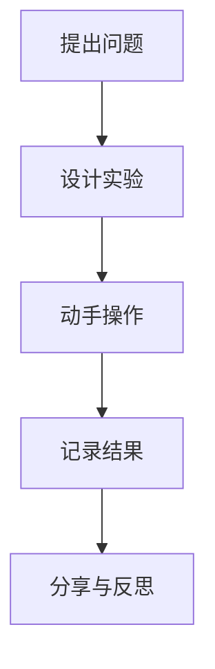

# 08-02 探索式学习设计-学生版-案例

## 1. 主题简介
本节通过具体案例，展示同学们在探索式学习中的有趣经历和收获，激发大家主动探索和创新的热情。

## 2. 理论基础
- 建构主义：通过亲身体验和思考获得知识。
- 问题驱动：学习从一个有趣的问题开始。

## 3. 关键概念
| 概念 | 解释 | 举例 |
|------|------|------|
| 探索 | 主动发现和研究新事物 | 观察植物生长 |
| 合作 | 和同学一起完成任务 | 小组实验 |
| 反思 | 回顾学习过程和收获 | 写学习日记 |

## 4. 学生案例
### 案例1：科学实验小达人
- 我们小组设计了"水为什么会蒸发？"的实验，记录了不同条件下水的变化。
- 过程：提出问题→设计实验→动手操作→记录结果→分享与反思
- 收获：学会了科学观察和动手能力。

### 案例2：社区调研小记者
- 我和同学们采访了社区居民，了解垃圾分类的现状，并提出改进建议。
- 过程：调研→数据收集→方案设计→成果展示
- 收获：提升了表达能力和社会责任感。

### 案例3：家庭探索小能手
- 我和爸爸妈妈一起观察家里的植物，记录它们的成长过程。
- 过程：观察→记录→讨论→反思
- 收获：发现了自然的奥秘，亲子关系更亲密。

## 5. 多表征展示

## 6. 学习建议
- 主动提问，勇敢表达自己的想法
- 多动手实践，记录每一步发现
- 和同学合作，互相帮助
- 及时反思，总结经验

## 7. 推荐资源
- 科学小实验书籍
- 探索类动画片
- [08-02-探索式学习设计-学生版](./08-02-探索式学习设计-学生版.md)

---

> 本文档为自动生成内容草案，欢迎同学们补充自己的探索故事！ 