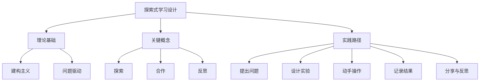

# 08-02 探索式学习设计-学生版-知识图谱

## 1. 主题简介
本知识图谱梳理探索式学习设计的核心概念、理论基础、实践路径及其相互关系，帮助同学们系统理解探索式学习。

## 2. 理论基础
- 建构主义：通过亲身体验和思考获得知识。
- 问题驱动：学习从一个有趣的问题开始。

## 3. 关键概念
| 概念 | 解释 |
|------|------|
| 探索式学习设计 | 强调主动探索和创新能力培养的学习方式 |
| 问题驱动 | 以有趣的问题引发学习兴趣 |
| 反思总结 | 回顾学习过程和收获 |

## 4. 知识图谱结构

## 5. 多表征展示
- 知识图谱结构图
- 概念表格
- 实践路径流程图

## 6. 学习建议
- 主动提问，勇敢表达自己的想法
- 多动手实践，记录每一步发现
- 和同学合作，互相帮助
- 及时反思，总结经验

## 7. 推荐资源
- XMind、MindMaster等思维导图工具
- 科学小实验书籍
- [08-02-探索式学习设计-学生版-案例](./08-02-探索式学习设计-学生版-案例.md)

---

> 本文档为自动生成内容草案，欢迎同学们补充完善自己的知识图谱！ 