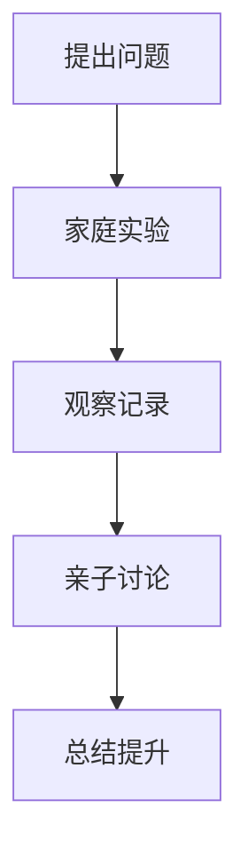

# 08-02 探索式学习设计-家长版-批判性分析

## 1. 主题简介

探索式学习设计在家庭教育中强调孩子主动探索、动手实践和创新能力的培养，但在实际家庭支持过程中也面临一些挑战。

## 2. 理论基础

- 建构主义：孩子通过亲身体验和反思获得知识。
- 问题驱动：以真实问题为起点，激发学习兴趣。

## 3. 关键概念

| 概念 | 解释 |
|------|------|
| 探索 | 鼓励孩子主动提问和实验 |
| 合作 | 亲子共同参与学习 |
| 反思 | 引导孩子总结经验 |

## 4. 批判性分析

### 优势

- 激发孩子的好奇心和学习兴趣
- 增进亲子关系，促进家庭共学
- 培养孩子的创新能力和独立思考能力

### 挑战

- 家长时间有限，难以持续陪伴
- 家庭资源和实验条件有限
- 家长缺乏科学引导和教育方法
- 孩子遇到困难时易产生挫败感

### 解决建议

- 合理安排家庭时间，利用碎片化时间进行探索活动
- 善用身边材料，设计简单可行的家庭实验
- 家长主动学习相关知识，提升引导能力
- 鼓励孩子面对困难，重视过程体验

## 5. 家庭案例

- 家长与孩子一起做"水的蒸发"实验，遇到实验失败时共同查找原因，最终获得成功

## 6. 多表征展示

## 7. 家庭建议

- 营造开放、鼓励提问的家庭氛围
- 参与孩子的探索活动，给予积极反馈
- 鼓励孩子记录和分享发现
- 关注过程，重视反思

## 8. 推荐资源

- 家庭科学实验书籍
- 亲子共学平台
- [08-02-探索式学习设计-家长版-案例](./08-02-探索式学习设计-家长版-案例.md)

---

> 本文档为自动生成内容草案，欢迎家长们结合实际补充自己的思考和建议！
