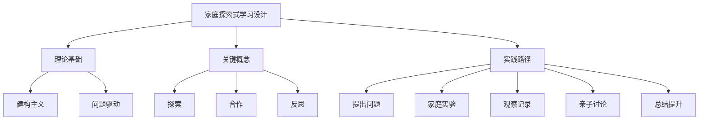

# 08-02 探索式学习设计-家长版-知识图谱

## 1. 主题简介
本知识图谱梳理家庭支持下探索式学习设计的核心概念、理论基础、实践路径及其相互关系，帮助家长系统理解该主题。

## 2. 理论基础
- 建构主义：孩子通过亲身体验和反思获得知识。
- 问题驱动：以真实问题为起点，激发学习兴趣。

## 3. 关键概念
| 概念 | 解释 |
|------|------|
| 探索式学习设计 | 强调主动探索和创新能力培养的家庭学习模式 |
| 问题驱动 | 以真实问题引发学习兴趣 |
| 反思总结 | 对学习过程和结果的回顾 |

## 4. 知识图谱结构

## 5. 多表征展示
- 知识图谱结构图
- 概念表格
- 实践路径流程图

## 6. 家庭支持建议
- 营造开放、鼓励提问的家庭氛围
- 参与孩子的探索活动，给予积极反馈
- 鼓励孩子记录和分享发现
- 关注过程，重视反思

## 7. 推荐资源
- XMind、MindMaster等思维导图工具
- 家庭科学实验书籍
- [08-02-探索式学习设计-家长版-案例](./08-02-探索式学习设计-家长版-案例.md)

---

> 本文档为自动生成内容草案，欢迎家长们结合实际补充完善。 