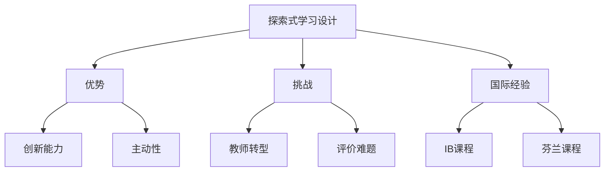

# 08-02 探索式学习设计-教师版-批判性分析

## 1. 主题简介

探索式学习设计作为课程创新的重要方向，强调学生主动探索、问题解决和创新能力的培养，但在实际教学中也面临诸多挑战。

## 2. 理论基础

- 建构主义学习理论
- 问题驱动学习（PBL）
- 国际探索式学习经验（IB、芬兰现象课程等）

## 3. 关键概念

| 概念 | 解释 |
|------|------|
| 探索式学习 | 以学生为中心、强调主动探索和创新能力培养的教学模式 |
| 问题驱动 | 以真实问题引发学习兴趣 |
| 反思总结 | 对学习过程和结果的回顾 |

## 4. 批判性分析

### 优势

- 激发学生主动性和创新精神
- 促进学科融合与深度学习
- 培养批判性思维和合作能力

### 挑战

- 教师角色转变难度大，需具备高水平的引导与设计能力
- 课程时间与进度压力，难以兼顾深度与广度
- 评价体系不完善，过程性成果难以量化
- 学生基础差异大，部分学生易掉队

### 国际比较

- IB课程、芬兰现象课程在探索式学习方面经验丰富，强调项目驱动与跨学科融合
- 国内探索式学习多处于试点阶段，需加强教师培训与资源建设

## 5. 案例分析

- IB小学项目单元：学生自主设计科学实验，教师提供"脚手架"支持
- 芬兰现象课程：以真实社会问题为主题，跨学科团队合作解决

## 6. 多表征分析

## 7. 教学建议

- 加强教师专业发展，提升课程设计与引导能力
- 合理安排课程进度，关注学生差异化支持
- 建立多元评价体系，重视过程性成果
- 借鉴国际经验，结合本土实际创新实践

## 8. 推荐资源

- IB课程与芬兰现象课程案例库
- 探索式学习设计相关书籍
- [08-02-探索式学习设计-教师版](./08-02-探索式学习设计-教师版.md)

---

> 本文档为自动生成内容草案，欢迎教师结合实际教学进一步完善。
