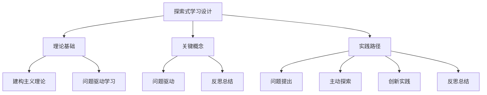

# 08-02 探索式学习设计-教师版-知识图谱

## 1. 主题简介

本知识图谱梳理探索式学习设计的核心概念、理论基础、实践路径及其相互关系，帮助教师系统理解该主题。

## 2. 理论基础

- 建构主义学习理论
- 问题驱动学习（PBL）
- 国际探索式学习经验

## 3. 关键概念

| 概念 | 解释 |
|------|------|
| 探索式学习设计 | 以学生为中心、强调主动探索和创新能力培养的课程开发与教学模式 |
| 问题驱动 | 以真实问题引发学习兴趣 |
| 反思总结 | 对学习过程和结果的回顾 |

## 4. 知识图谱结构

## 5. 多表征展示

- 知识图谱结构图
- 概念表格
- 实践路径流程图

## 6. 教学建议

- 利用知识图谱梳理探索活动设计思路
- 结合学科特点创新教学实践
- 鼓励学生自主梳理知识结构

## 7. 推荐资源

- XMind、MindMaster等思维导图工具
- 探索式学习设计书籍
- [08-02-探索式学习设计-教师版-案例](./08-02-探索式学习设计-教师版-案例.md)

---

> 本文档为自动生成内容草案，欢迎教师结合实际教学进一步完善。
