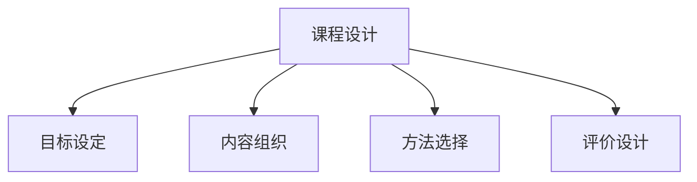

# 08-01 课程设计-批判性分析

## 1. 主题简介

课程设计是指根据教育目标、学科特点和学生需求，系统规划和组织教学内容、方法与评价的过程。

## 2. 理论基础

- 课程开发理论（如泰勒原理、布鲁姆目标分类）
- 学科整合理论
- 国际课程设计经验（如IB、芬兰现象课程等）

## 3. 关键概念与定义

| 概念 | 定义 | 例子 |
|------|------|------|
| 课程目标 | 教学活动期望达成的学习成果 | 培养批判性思维 |
| 学科整合 | 跨学科融合设计课程 | STEAM项目课程 |

## 4. 实践案例

- IB课程单元设计
- 芬兰现象课程开发
- 中国小学主题探究课程

## 5. 多表征分析

## 6. 教学建议

- 教师：关注学生差异，灵活调整课程结构
- 家长：参与课程反馈，支持家庭学习
- 学生：主动参与课程设计，提出建议

## 7. 相关资源与拓展

- 推荐书籍：《课程与教学论》
- 相关主题：[08-01-课程设计-教师版](../教师版/08-01-课程设计-教师版.md)

---

> 本文档为自动生成内容草案，后续可根据实际教学与研究需要补充完善。
