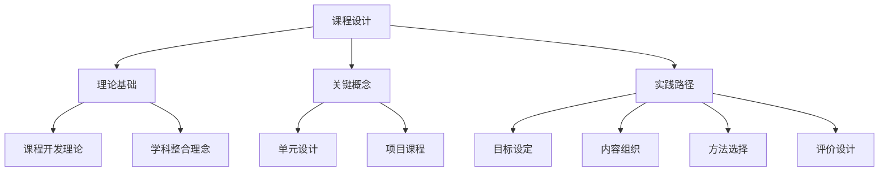
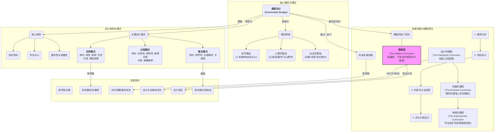

# 08-01 课程设计-知识图谱

## 1. 主题简介

本知识图谱梳理课程设计的核心概念、理论基础、实践路径及其相互关系，帮助教师、家长和学生系统理解该主题。

## 2. 理论基础

- 课程开发理论
- 学科整合理念
- 国际课程设计经验

## 3. 关键概念与定义

| 概念 | 定义 |
|------|------|
| 课程设计 | 系统规划和组织教学内容、方法与评价的过程 |
| 单元设计 | 以主题为核心的课程模块 |
| 项目课程 | 以实际问题为导向的课程 |

## 4. 知识图谱结构

## 5. 教学建议

- 教师：利用知识图谱梳理课程开发思路
- 家长：参考图谱参与家庭课程设计
- 学生：通过图谱自查课程进展

## 6. 相关资源与拓展

- 推荐工具：XMind、MindMaster
- 相关主题：[08-01-课程设计-案例](./08-01-课程设计-案例.md)

---

> 本文档为自动生成内容草案，后续可根据实际教学与研究需要补充完善。

